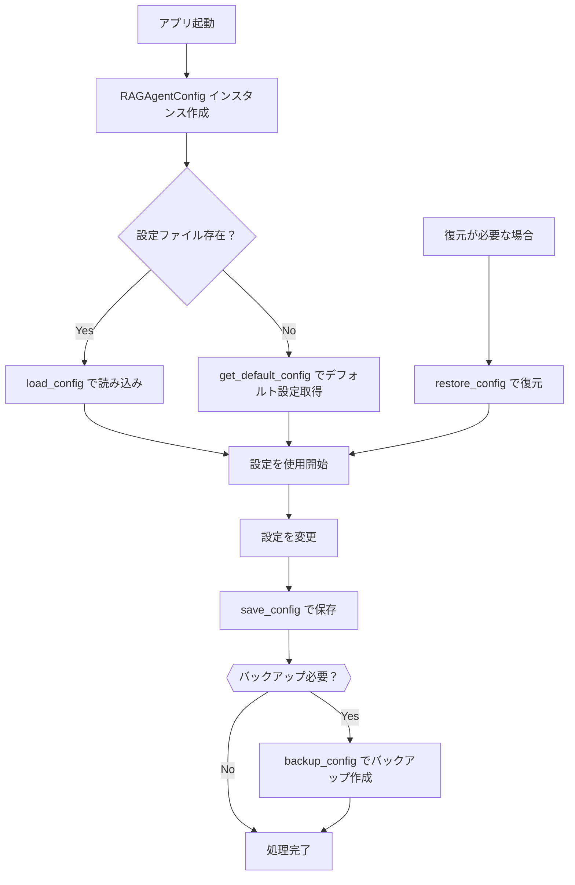
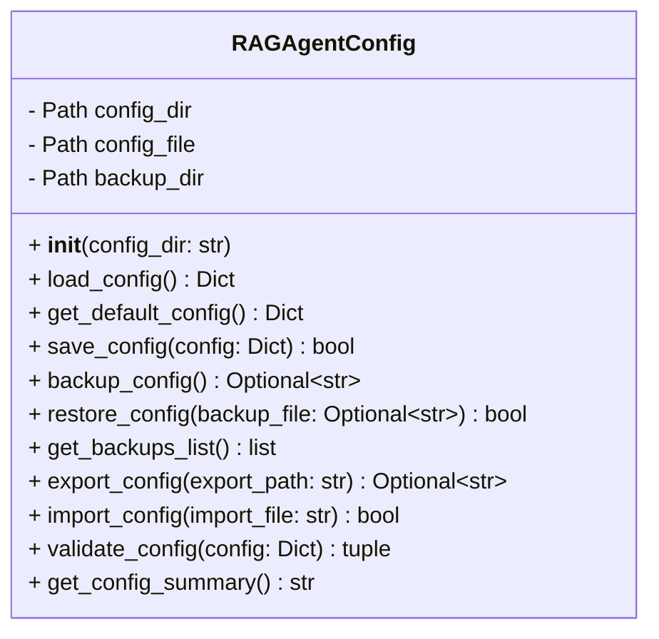
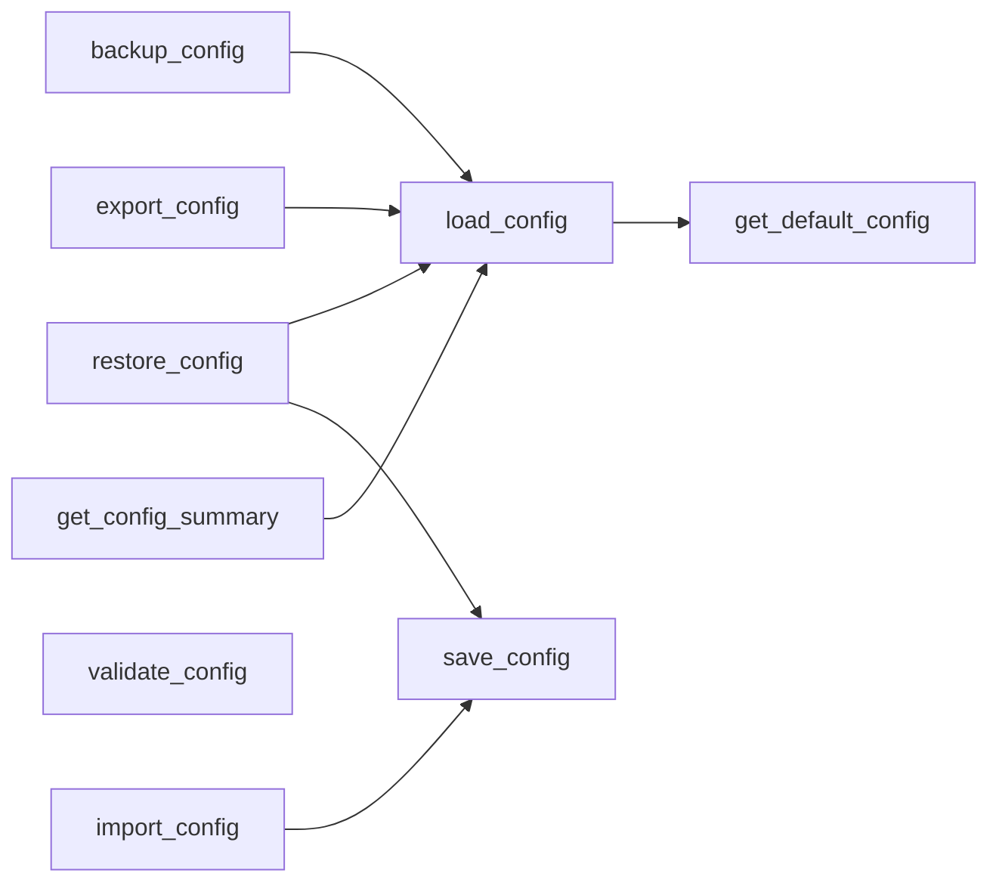
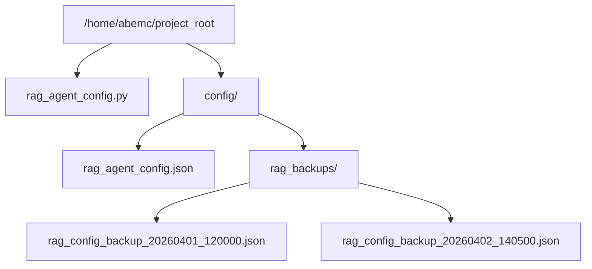

# RAGAgentConfig クラス詳細仕様書

## 1. 概要

`RAGAgentConfig` クラスは、RAG (Retrieval-Augmented Generation) エージェントの設定を一元管理するモジュールです。設定の保存・読み込み、バックアップ・復元、エクスポート・インポート、検証、サマリー表示など、包括的な設定管理機能を提供します。

---

## 2. ファイル構成

```
/home/abemc/project_root/
├── rag_agent_config.py          # RAGAgentConfig クラスの実装ファイル
└── config/
    ├── rag_agent_config.json    # 設定ファイル（JSON形式）
    └── rag_backups/             # 設定バックアップディレクトリ
        ├── rag_config_backup_YYYYMMDD_HHMMSS.json
        └── ...
```

---

## 3. クラス設計

### 3.1 属性（Properties）

| 属性名 | 型 | 説明 |
|--------|-----|------|
| `config_dir` | `Path` | 設定ディレクトリのパス |
| `config_file` | `Path` | 設定ファイルのパス (`config_dir/rag_agent_config.json`) |
| `backup_dir` | `Path` | バックアップディレクトリのパス (`config_dir/rag_backups`) |

### 3.2 メソッド（Methods）

#### 3.2.1 初期化メソッド

##### `__init__(config_dir: str = "/home/abemc/project_root/config")`
- **目的**: クラスを初期化し、設定ディレクトリとファイルを準備
- **入力**:
  - `config_dir`: 設定ディレクトリのパス（デフォルト: `/home/abemc/project_root/config`）
- **処理内容**:
  1. `config_dir` を `Path` オブジェクトに変換
  2. `config_dir` が存在しない場合は作成（親ディレクトリも含める）
  3. `config_file` を `config_dir/rag_agent_config.json` に設定
  4. `backup_dir` を `config_dir/rag_backups` に設定
  5. `backup_dir` が存在しない場合は作成
- **出力**: なし

---

#### 3.2.2 設定読み込み・保存メソッド

##### `load_config() -> Dict`
- **目的**: 設定ファイルを読み込む
- **入力**: なし
- **処理内容**:
  1. `config_file` の存在確認
  2. 存在する場合: ファイルをUTF-8で読み込み、JSON形式でパース
  3. 存在しない場合: デフォルト設定を返す
- **出力**: 設定辞書（`Dict`）
- **エラーハンドリング**: ファイル読み込みエラー時は例外発生

---

##### `get_default_config() -> Dict`
- **目的**: デフォルト設定を返す
- **入力**: なし
- **処理内容**: 以下のデフォルト設定を辞書として返す
- **デフォルト設定内容**:

| キー | 値 | 説明 |
|------|-----|------|
| `version` | `"1.0"` | 設定スキームのバージョン |
| `created` | ISO形式の日時 | 設定作成日時 |
| `llm_model` | `"GPT-4o"` | 使用するLLMモデル名 |
| `search_method` | `"ハイブリッド"` | 検索方式（ハイブリッド、BM25、セマンティック等） |
| `top_k` | `5` | 検索で取得するドキュメント数 |
| `confidence_threshold` | `0.7` | 信頼度の閾値（0-1） |
| `document_categories` | `["root", "reports", "guides"]` | 対象ドキュメントカテゴリ |
| `enable_cache` | `True` | キャッシュ機能の有効化 |
| `cache_ttl` | `3600` | キャッシュの有効期限（秒） |
| `max_tokens` | `2000` | 生成トークン上限 |
| `temperature` | `0.7` | 生成時の温度（0-2） |
| `system_prompt` | 文字列 | システムプロンプト |
| `enable_source_attribution` | `True` | ソース帰属情報の表示 |
| `enable_follow_up_questions` | `True` | 続問の提案 |
| `language` | `"ja"` | インターフェース言語 |
| `backup_location` | `"/mnt/d/backups"` | バックアップ保存先 |

---

##### `save_config(config: Dict) -> bool`
- **目的**: 設定をファイルに保存
- **入力**:
  - `config`: 保存する設定辞書
- **処理内容**:
  1. `last_modified` フィールドに現在の日時（ISO形式）を追加
  2. 設定をUTF-8、インデント2でJSON形式で保存
  3. 保存成功時は `True` を返す
- **出力**: `True`（成功）または `False`（失敗）
- **エラーハンドリング**: 例外発生時はエラーメッセージをプリント、`False` を返す

---

#### 3.2.3 バックアップ管理メソッド

##### `backup_config() -> Optional[str]`
- **目的**: 現在の設定をバックアップ
- **入力**: なし
- **処理内容**:
  1. 現在の設定を読み込む
  2. タイムスタンプを生成（形式: `YYYYMMDD_HHMMSS`）
  3. バックアップファイル名を生成：`rag_config_backup_{timestamp}.json`
  4. バックアップディレクトリにファイルを保存
- **出力**: バックアップファイルのパス（文字列）、失敗時は `None`
- **エラーハンドリング**: 例外発生時はエラーメッセージをプリント、`None` を返す

---

##### `restore_config(backup_file: Optional[str] = None) -> bool`
- **目的**: バックアップから設定を復元
- **入力**:
  - `backup_file`: 復元するバックアップファイルのパス（`None` の場合は最新のバックアップを使用）
- **処理内容**:
  1. `backup_file` が指定されていない場合、バックアップディレクトリから最新のバックアップを取得
  2. 最新のバックアップがない場合はエラーメッセージをプリント、`False` を返す
  3. バックアップファイルを読み込み、JSON形式でパース
  4. パースした設定を保存（`save_config` を呼び出し）
  5. 成功時は `True` を返す
- **出力**: `True`（成功）または `False`（失敗）
- **エラーハンドリング**: ファイル読み込みエラーやパースエラーの場合、エラーメッセージをプリント、`False` を返す

---

##### `get_backups_list() -> list`
- **目的**: バックアップファイルの一覧を取得
- **入力**: なし
- **処理内容**:
  1. バックアップディレクトリから `rag_config_backup_*.json` ファイルを検索
  2. 更新日時の新しい順にソート
  3. 各ファイルについて以下の情報を取得：
     - `name`: ファイル名
     - `path`: ファイルパス
     - `size`: ファイルサイズ（バイト）
     - `modified`: 最終更新日時（形式: `YYYY-MM-DD HH:MM:SS`）
  4. 情報をリストとして返す
- **出力**: バックアップ情報の辞書リスト
- **エラーハンドリング**: 例外発生時はエラーメッセージをプリント、空リストを返す

---

#### 3.2.4 エクスポート・インポートメソッド

##### `export_config(export_path: str) -> Optional[str]`
- **目的**: 設定を指定したフォルダにエクスポート
- **入力**:
  - `export_path`: エクスポート先フォルダーパス
- **処理内容**:
  1. エクスポート先ディレクトリが存在しない場合は作成
  2. 書き込み権限を確認（権限がない場合は `PermissionError` 発生）
  3. 現在の設定を読み込む
  4. タイムスタンプ付きのエクスポートファイル名を生成
  5. 設定をUTF-8、インデント2でJSON形式で保存
  6. ファイルが正常に生成されたか確認
  7. 成功時はファイルパスを返す
- **出力**: エクスポートファイルのパス（文字列）、失敗時は `None`
- **エラーハンドリング**:
  - `PermissionError`: 権限エラーメッセージをプリント、例外を再発生
  - `OSError`: ファイルシステムエラーメッセージをプリント、例外を再発生
  - その他の例外: エラーメッセージをプリント、`None` を返す

---

##### `import_config(import_file: str) -> bool`
- **目的**: 外部ファイルから設定をインポート
- **入力**:
  - `import_file`: インポートするファイルパス
- **処理内容**:
  1. インポートファイルをUTF-8で読み込み、JSON形式でパース
  2. パースした設定を保存（`save_config` を呼び出し）
  3. 成功時は `True` を返す
- **出力**: `True`（成功）または `False`（失敗）
- **エラーハンドリング**: 例外発生時はエラーメッセージをプリント、`False` を返す

---

#### 3.2.5 検証メソッド

##### `validate_config(config: Dict) -> tuple`
- **目的**: 設定の必須フィールドや値の妥当性を検証
- **入力**:
  - `config`: 検証する設定辞書
- **処理内容**:
  1. 必須フィールドの存在確認：
     - `llm_model`
     - `search_method`
     - `top_k`
     - `confidence_threshold`
     - `temperature`
  2. 各フィールドの値の範囲チェック：
     - `top_k`: 1-50の範囲内
     - `confidence_threshold`: 0-1の範囲内
     - `temperature`: 0-2の範囲内
  3. エラーがない場合は `(True, [])` を返す
  4. エラーがある場合は `(False, [エラーメッセージリスト])` を返す
- **出力**: タプル `(is_valid: bool, errors: list)`
- **エラーメッセージ形式**: `"❌ 〇〇: 〇〇"`

---

#### 3.2.6 表示メソッド

##### `get_config_summary() -> str`
- **目的**: 現在の設定の概要を整形して出力
- **入力**: なし
- **処理内容**:
  1. 現在の設定を読み込む
  2. 以下の情報をセクション分けして整形：
     - **モデル設定**: LLMモデル、検索方式、言語
     - **検索パラメータ**: 取得ドキュメント数、信頼度閾値、対象カテゴリ
     - **生成パラメータ**: 温度、トークン上限、キャッシュ有効化
     - **バックアップ先**: バックアップ保存先パス
     - **最終更新**: 最終更新日時
- **出力**: 整形されたサマリー文字列（マークダウン形式）

---

## 4. 処理フロー

### 4.1 設定管理のライフサイクル



---

## 5. 使用例

### 5.1 基本的な使用方法

```python
from rag_agent_config import RAGAgentConfig

# インスタンス作成
config_manager = RAGAgentConfig()

# 設定を読み込む
config = config_manager.load_config()
print(config)

# 設定を変更して保存
config['llm_model'] = 'GPT-4-Turbo'
config['temperature'] = 0.8
config_manager.save_config(config)

# バックアップ作成
backup_path = config_manager.backup_config()
print(f"Backup created at: {backup_path}")

# 設定のサマリーを表示
summary = config_manager.get_config_summary()
print(summary)
```

### 5.2 検証付きの保存

```python
# 設定の検証
is_valid, errors = config_manager.validate_config(config)
if is_valid:
    config_manager.save_config(config)
    print("✅ 設定が保存されました")
else:
    print("❌ 設定に問題があります:")
    for error in errors:
        print(f"  {error}")
```

### 5.3 バックアップから復元

```python
# 最新のバックアップから復元
success = config_manager.restore_config()
if success:
    print("✅ 復元成功")

# 特定のバックアップから復元
success = config_manager.restore_config(
    backup_file="/home/abemc/project_root/config/rag_backups/rag_config_backup_20260401_120000.json"
)
```

### 5.4 エクスポート・インポート

```python
# 設定をエクスポート
export_path = config_manager.export_config("/home/abemc/exports")
print(f"Exported to: {export_path}")

# 設定をインポート
success = config_manager.import_config("/home/abemc/exports/rag_agent_config_20260401_120000.json")
if success:
    print("✅ インポート成功")
```

---

## 6. エラーハンドリング

| メソッド | エラータイプ | 対応 |
|---------|------------|------|
| `save_config` | 一般例外 | エラーメッセージをプリント、`False` を返す |
| `backup_config` | 一般例外 | エラーメッセージをプリント、`None` を返す |
| `restore_config` | 一般例外 | エラーメッセージをプリント、`False` を返す |
| `export_config` | `PermissionError` | エラーメッセージをプリント、例外を再発生 |
| `export_config` | `OSError` | エラーメッセージをプリント、例外を再発生 |
| `export_config` | その他の例外 | エラーメッセージをプリント、`None` を返す |
| `import_config` | 一般例外 | エラーメッセージをプリント、`False` を返す |

---

## 7. 構成図

### 7.1 クラス図



---

### 7.2 メソッド呼び出し関係図



---

### 7.3 ファイル構造図



---

## 8. パフォーマンス考慮事項

- **ファイルI/O**: JSON の読み書きはディスクアクセスが発生するため、頻繁な呼び出しはアプリケーションのパフォーマンス低下につながる可能性があります。
- **バックアップサイズ**: バックアップが多数蓄積するとディスク容量を圧迫する可能性があります。定期的に古いバックアップを削除することを推奨します。
- **エンコーディング**: UTF-8 でエンコード・デコードされるため、非ASCII文字を含む設定値も安全に処理できます。

---

## 9. セキュリティ考慮事項

- **ファイルパーミッション**: 設定ファイルには機密情報が含まれる可能性があるため、適切なファイルパーミッション（例：600）を設定することを推奨します。
- **バックアップの保護**: バックアップファイルも同様に保護する必要があります。
- **エラーメッセージ**: エラーメッセージに機密情報が含まれないよう注意してください。

---

## 10. 今後の改善提案

1. **ロギング機能の強化**: `print` 文ではなく、ロギングライブラリ（例：`logging`）を使用して、より詳細なログを記録。
2. **ユニットテスト**: 各メソッドの動作を検証するテストコードの作成。
3. **設定スキーマの定義**: Pydantic やその他のスキーマ検証ライブラリを使用して、設定の型チェックを強化。
4. **暗号化**: 機密情報を暗号化して保存。
5. **バージョン管理**: 設定の変更履歴を追跡し、特定のバージョンにロールバック可能な機能。
6. **リモートバックアップ**: クラウドストレージへのバックアップ機能。

---

**作成日時**: 2026-04-26  
**最終更新**: 2026-04-26  
**バージョン**: 1.0
