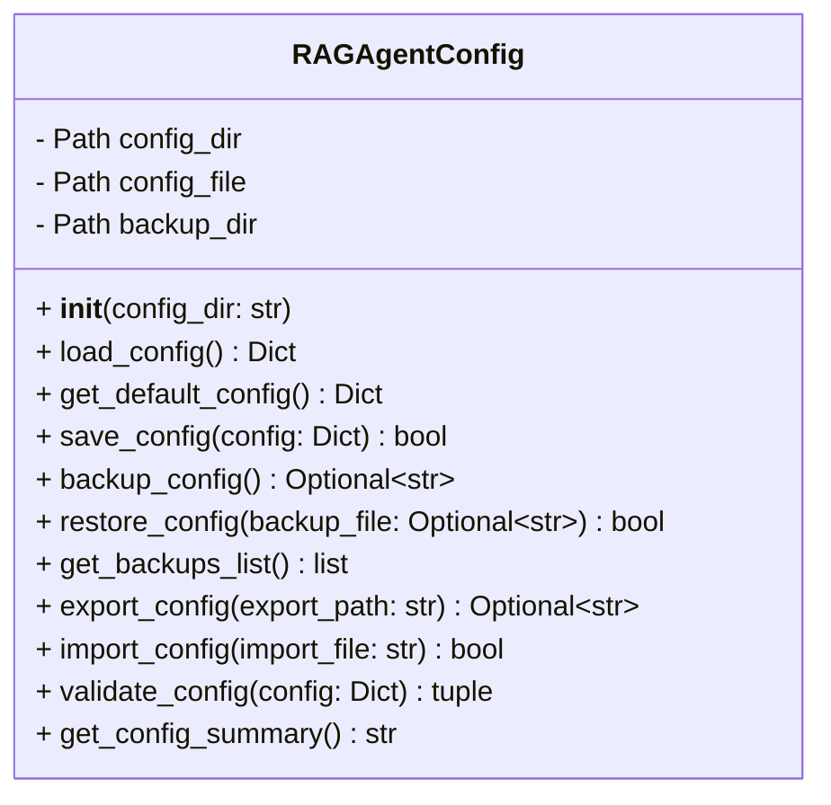

# RAGAgentConfig クラス仕様書

## 概要
`RAGAgentConfig` クラスは、RAG (Retrieval-Augmented Generation) エージェントの設定を管理するためのモジュールです。設定の保存、読み込み、バックアップ、エクスポート、インポート、検証などの機能を提供します。

---

## クラス構成

### 属性
- `config_dir` (Path): 設定ディレクトリのパス。
- `config_file` (Path): 設定ファイルのパス。
- `backup_dir` (Path): バックアップディレクトリのパス。

### メソッド
- `__init__(config_dir: str)`: クラスの初期化。設定ディレクトリとファイルを準備。
- `load_config() -> Dict`: 設定ファイルを読み込む。存在しない場合はデフォルト設定を返す。
- `get_default_config() -> Dict`: デフォルト設定を返す。
- `save_config(config: Dict) -> bool`: 設定をファイルに保存。
- `backup_config() -> Optional[str]`: 現在の設定をバックアップ。
- `restore_config(backup_file: Optional[str]) -> bool`: バックアップから設定を復元。
- `get_backups_list() -> list`: バックアップファイルの一覧を取得。
- `export_config(export_path: str) -> Optional[str]`: 設定を指定したフォルダにエクスポート。
- `import_config(import_file: str) -> bool`: 外部ファイルから設定をインポート。
- `validate_config(config: Dict) -> tuple`: 設定の必須フィールドや値の妥当性を検証。
- `get_config_summary() -> str`: 現在の設定の概要を整形して出力。

---

## 構成図
以下は `RAGAgentConfig` クラスの構成図です。

