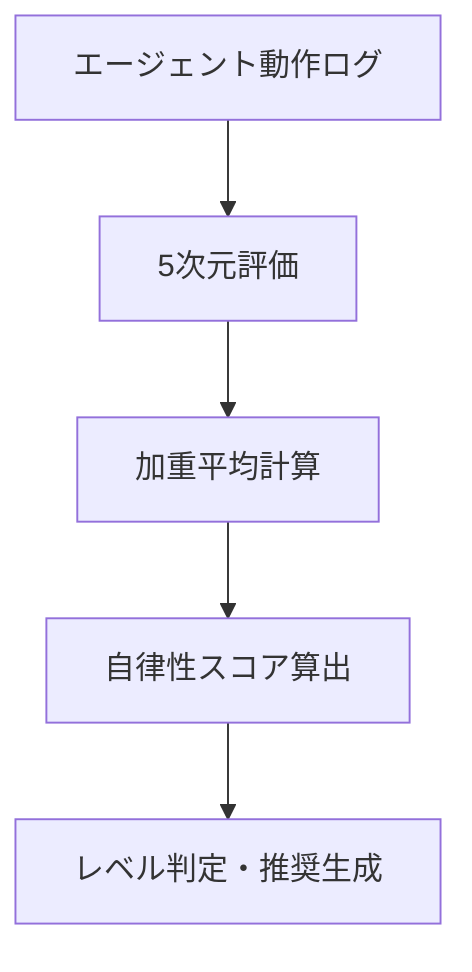
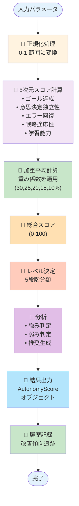
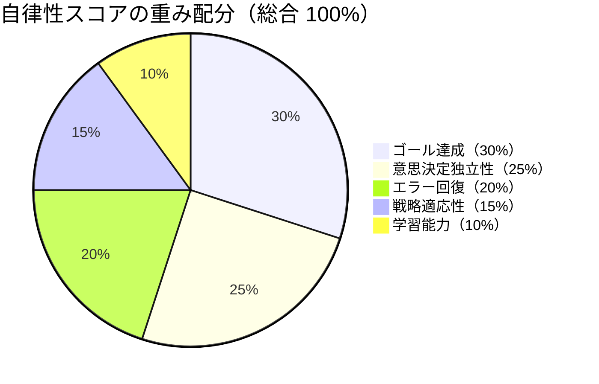
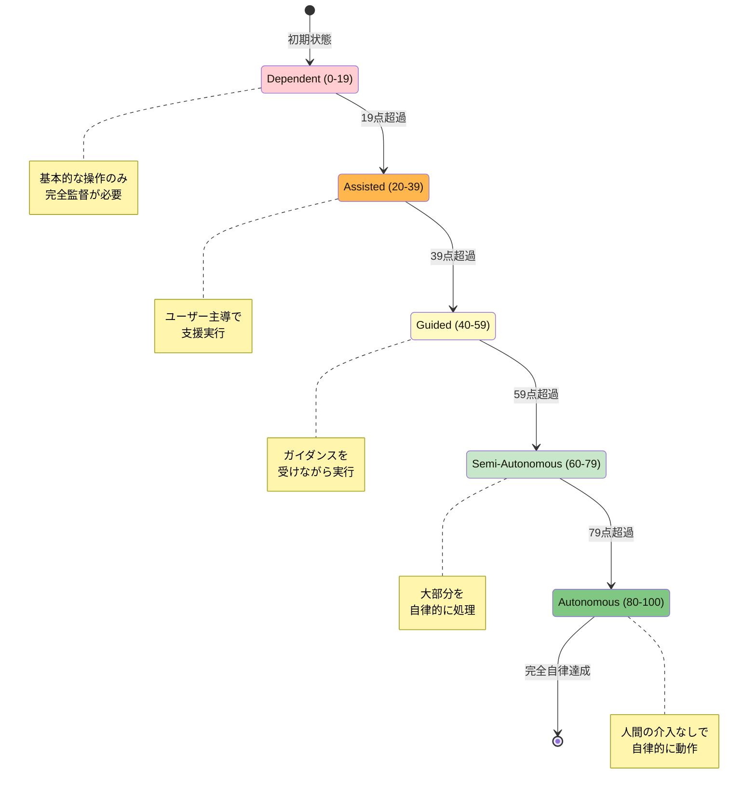

# Autonomy Scorer モジュール仕様書

---

## 📝 初心者向け要約
> **このドキュメントで分かること**
> - 自律性スコアラーの目的と使い方
> - 5次元評価の仕組み
> - 評価フロー（図解付き）
> - どんな場面で役立つか

### 📊 自律性評価フロー図（Mermaid記法）


> **所属**: 技術仕様書群  
> **分類**: エージェント・自律性評価  
> **対象読者**: ML技術者・評価エンジニア  
> **参照**: [ドキュメント管理ダッシュボード](../00_プロジェクト概要/DOCUMENTATION_DASHBOARD.md)

### 📊 図表を見る

- **📖 本ドキュメント内**: 以下のテキスト図表をご参照ください
- **🌐 ブラウザで詳細図を表示**: [Mermaid図表プレビュー (ブラウザで開く)](../autonomy_diagrams.html) 
  - システムフロー、パイチャート、レベル遷移、シーケンス図がインタラクティブに表示されます
- **📄 VS Code プレビュー**: VS Code で **Ctrl+K V** を押すと Markdown が見やすく表示されます

## 目次
1. [概要](#概要)
2. [モジュール構成](#モジュール構成)
3. [設計思想](#設計思想)
4. [データ構造](#データ構造)
5. [API リファレンス](#apiリファレンス)
6. [使用例](#使用例)
7. [計算アルゴリズム](#計算アルゴリズム)
8. [自律性レベル判定](#自律性レベル判定)

---

## 概要

### 目的
エージェント（自動実行システム）の自律性を定量的に測定・評価するモジュールです。複数次元での能力を測定し、統合的な自律性スコア（0-100）を算出します。

### 主な機能
- **5次元測定**: ゴール達成、意思決定独立性、エラー回復、戦略適応、学習能力
- **加重平均計算**: 各次元に異なる重み付けを適用
- **レベル判定**: 5段階の自律性レベル決定（Dependent ～ Autonomous）
- **履歴管理**: 複数回の評価から改善傾向を追跡
- **推奨生成**: レベルと弱点に基づいた改善推奨の自動生成
### 対象ユーザー
- AI/ML エンジニア
- システム監視・評価担当者
- 自動化システムの性能評価者

---

## モジュール構成

```
autonomy_scorer.py
├── AutonomyDimension (Enum)
│   └── 5つの評価次元の定義
├── DimensionalAutonomy (dataclass)
│   ├── to_dict()
│   └── get_average()
├── AutonomyScore (dataclass)
│   └── 評価結果コンテナ
└── AutonomyScorer (class)
    ├── calculate_score()          [メイン計算メソッド]
    ├── _normalize()               [正規化]
    ├── _calculate_strategy_adaptation()  [戦略評価]
    ├── _calculate_weighted_score() [加重平均]
    ├── _determine_level()         [レベル決定]
    ├── _identify_strengths_weaknesses()  [強弱判定]
    ├── _generate_recommendations() [推奨生成]
    ├── get_improvement_trend()    [改善傾向]
    ├── get_average_score()        [平均スコア]
    └── reset_history()            [履歴リセット]

evaluate_autonomy_simple() [テスト用シンプル関数]
```

### システム処理フロー

次の9つのステップで自律性スコアが計算されます：



処理の詳細：

1. **入力指標を受け取る**（5つのパラメータ）
2. **正規化処理**（0-1 範囲に変換、クリップ処理）
3. **5次元スコア計算**
   - ゴール達成度
   - 意思決定独立性
   - エラー回復率
   - 戦略適応性
   - 学習能力
4. **加重平均計算**（重み係数を適用、各次元を統合）
5. **総合スコア計算**（0-100 ポイント）
6. **レベル決定**（Dependent～Autonomous、5段階に分類）
7. **強み弱み判定**（強み>=75%、弱み<=40%）
8. **改善推奨生成**（レベル別推奨、優先度付け）
9. **評価結果出力**（AutonomyScore オブジェクト）
10. **履歴に記録**（改善傾向追跡、成長率計算）

---

## 設計思想

### 1. 5次元の独立性
各次元は独立した評価軸で、相互に影響しません。これにより：
- 多角的な分析が可能
- 特定の弱点を明確に特定
- 改善の優先順位づけが容易

### 2. 加重平均による統合
各次元に異なる重み付けを適用：
```
総合スコア = Σ(次元スコア × 重み係数)
```

重み係数は次元の相対的重要度を反映：
| 次元 | 重み | 理由 |
|-----|------|-----|
| ゴール達成 | 30% | 最も重要（目標達成が最優先） |
| 意思決定独立性 | 25% | 自律性の中核 |
| エラー回復 | 20% | 堅牢性確保 |
| 戦略適応性 | 15% | 状況対応力 |
| 学習能力 | 10% | 長期的成長 |

**重み配分の可視化**:



重み係数の配分は以下の通りです（合計100%）:

- ゴール達成: 30%（最も重要。目標達成が最優先）
- 意思決定独立性: 25%（自律性の中核）
- エラー回復: 20%（堅牢性確保）
- 戦略適応性: 15%（状況対応力）
- 学習能力: 10%（長期的成長）

### 3. 段階的な履歴追跡
複数回の評価から改善傾向を分析：
- 初期スコアとの比較
- 平均パフォーマンス
- 成長率の計算

### 4. 実行可能な推奨生成
各レベルに応じた具体的な改善提案：
- 現状維持型推奨（Autonomous）
- 弱点補強型推奨（Semi-Autonomous）
- 学習メカニズム改善型推奨（Guided）
- 大規模改善型推奨（Assisted/Dependent）

---

## データ構造

### AutonomyDimension (Enum)

自律性評価の5つの次元を定義します。

```python
class AutonomyDimension(Enum):
    GOAL_ACHIEVEMENT = "goal_achievement"           # 30% 重み
    DECISION_INDEPENDENCE = "decision_independence" # 25% 重み
    ERROR_RECOVERY = "error_recovery"               # 20% 重み
    STRATEGY_ADAPTATION = "strategy_adaptation"     # 15% 重み
    LEARNING_CAPABILITY = "learning_capability"     # 10% 重み
```

| 次元 | 説明 | 計算方法 | 目標値 |
|-----|-----|--------|------|
| **GOAL_ACHIEVEMENT** | タスク成功率 | 成功数 / 総数 | 90%+ |
| **DECISION_INDEPENDENCE** | ユーザー介入なしの決定率 | 独立決定数 / 総決定数 | 80%+ |
| **ERROR_RECOVERY** | エラー回復率 | 自動修復数 / 総エラー数 | 85%+ |
| **STRATEGY_ADAPTATION** | 戦略変更の適切性 | 理想値とのズレで評価 | 最適値±0 |
| **LEARNING_CAPABILITY** | 改善率 | (最終 - 初期) / 初期 | 60%+ |

---

### DimensionalAutonomy (dataclass)

5つの次元スコアを保持するコンテナ。

```python
@dataclass
class DimensionalAutonomy:
    goal_achievement: float = 0.0        # 0-1
    decision_independence: float = 0.0   # 0-1
    error_recovery: float = 0.0          # 0-1
    strategy_adaptation: float = 0.0     # 0-1
    learning_capability: float = 0.0     # 0-1
```

#### メソッド

**`to_dict() -> Dict[str, float]`**
- 各次元を辞書形式に変換
- キー: 次元名（英数字）
- 値: スコア（0-1）

**`get_average() -> float`**
- 5次元の平均スコア（加重なし）参考情報用

---

### AutonomyScore (dataclass)

総合評価結果を格納するコンテナ。`calculate_score()` の戻り値です。

```python
@dataclass
class AutonomyScore:
    dimensions: DimensionalAutonomy      # 5次元の詳細スコア
    overall_score: float                 # 総合スコア (0-100)
    autonomy_level: str                  # レベル名
    strengths: List[str] = ...           # 強みリスト
    weaknesses: List[str] = ...          # 弱みリスト
    recommendations: List[str] = ...     # 改善推奨
    timestamp: Optional[str] = None      # 評価日時（ISO 8601）
```

#### 属性詳細

| 属性 | 型 | 説明 | 例 |
|------|-----|-----|-----|
| `dimensions` | DimensionalAutonomy | 各次元の詳細スコア | - |
| `overall_score` | float | 加重平均による総合スコア | 82.5 |
| `autonomy_level` | str | 5段階レベル | "Semi-Autonomous" |
| `strengths` | List[str] | スコア 75% 以上の次元 | ["Goal Achievement: 92%"] |
| `weaknesses` | List[str] | スコア 40% 以下の次元 | ["Learning Capability: 38%"] |
| `recommendations` | List[str] | 改善推奨のリスト | ["学習メカニズムを改善..."] |
| `timestamp` | Optional[str] | 評価実施日時 | "2025-04-21T10:30:00" |

---

## API リファレンス

### AutonomyScorer クラス

#### コンストラクタ

```python
scorer = AutonomyScorer()
```

**説明**: スコアラーを初期化します。
**パラメータ**: なし
**戻り値**: AutonomyScorer インスタンス

---

#### メインメソッド: calculate_score()

```python
def calculate_score(
    task_success_rate: float,
    user_intervention_rate: float,
    error_recovery_rate: float,
    strategy_switches: int,
    learning_rate: float,
    total_attempts: int = 1,
) -> AutonomyScore:
```

**説明**: 複数の入力指標から自律性スコアを計算します（メインメソッド）。

**パラメータ**:

| パラメータ | 型 | 範囲 | 説明 | 例 |
|-----------|-----|------|-----|-----|
| `task_success_rate` | float | 0-1 | タスク成功率 | 0.95 |
| `user_intervention_rate` | float | 0-1 | ユーザー介入率 | 0.10 |
| `error_recovery_rate` | float | 0-1 | エラー回復率 | 0.90 |
| `strategy_switches` | int | ≥0 | 戦略変更回数 | 3 |
| `learning_rate` | float | 任意 | 学習率（改善率） | 0.15 |
| `total_attempts` | int | ≥1 | 総試行回数（デフォルト=1） | 20 |

**戻り値**: `AutonomyScore` - 詳細な評価結果

**処理フロー**:
1. 各入力指標を 0-1 に正規化
2. 5次元スコアに変換
3. 加重平均で総合スコア計算（0-100）
4. 自律性レベルを決定
5. 強み・弱みを特定
6. 改善推奨を生成
7. 履歴に記録

**使用例**:
```python
scorer = AutonomyScorer()
score = scorer.calculate_score(
    task_success_rate=0.95,
    user_intervention_rate=0.10,
    error_recovery_rate=0.90,
    strategy_switches=3,
    learning_rate=0.15,
    total_attempts=20
)
print(f"スコア: {score.overall_score:.1f}")    # 82.5
print(f"レベル: {score.autonomy_level}")       # Semi-Autonomous
print(f"推奨: {score.recommendations}")
```

---

#### get_improvement_trend()

```python
def get_improvement_trend() -> Optional[float]:
```

**説明**: 評価履歴から改善傾向を算出（成長率%）。

**戻り値**: 
- `float`: 成長率（%）
  - 正値: 改善（例: 25% 改善）
  - 負値: 悪化（例: -7% 悪化）
  - `None`: 計算不可（評価1回以下または初期スコア=0）

**使用例**:
```python
# 複数回評価後
trend = scorer.get_improvement_trend()
if trend:
    if trend >= 20:
        print(f"大幅改善: {trend:.1f}%")
    elif trend > 0:
        print(f"着実な改善: {trend:.1f}%")
    else:
        print(f"悪化: {trend:.1f}%")
```

---

#### get_average_score()

```python
def get_average_score() -> Optional[float]:
```

**説明**: 評価履歴の平均スコアを計算。

**戻り値**:
- `float`: 平均スコア（0-100）
- `None`: 評価履歴が空

**使用例**:
```python
avg = scorer.get_average_score()
if avg:
    print(f"平均スコア: {avg:.1f}")
```

---

#### reset_history()

```python
def reset_history() -> None:
```

**説明**: 評価履歴をクリアしてから新しいサイクルを開始。

**戻り値**: なし

**使用例**:
```python
scorer.reset_history()  # 履歴をクリア
# ... 新しい評価サイクル開始 ...
```

---

### 簡易関数: evaluate_autonomy_simple()

```python
def evaluate_autonomy_simple(
    success_rate: float,
    intervention_rate: float = 0.0,
) -> float:
```

**説明**: 最小限のパラメータで自律性スコアを計算（テスト・デモ用）。

**パラメータ**:

| パラメータ | 型 | デフォルト | 説明 |
|-----------|-----|---------|-----|
| `success_rate` | float | 必須 | タスク成功率（0-1） |
| `intervention_rate` | float | 0.0 | ユーザー介入率（0-1） |

**デフォルト設定**（自動設定される値）:
```
error_recovery_rate = success_rate + 0.1
strategy_switches = 1
learning_rate = 0.5
total_attempts = 5
```

**戻り値**: `float` - 自律性スコア（0-100）

**使用例**:
```python
# シンプルな計算
score1 = evaluate_autonomy_simple(success_rate=0.95)
# → 79.5

# 介入率を含む
score2 = evaluate_autonomy_simple(
    success_rate=0.90,
    intervention_rate=0.15
)
# → 介入率を考慮したスコア
```

---

## 使用例

### 例1: 基本的な自律性評価

```python
from src.agent.autonomy.autonomy_scorer import AutonomyScorer

# スコアラーを初期化
scorer = AutonomyScorer()

# 指標を計測して評価
result = scorer.calculate_score(
    task_success_rate=0.92,      # 92% の成功率
    user_intervention_rate=0.08,  # 8% の介入
    error_recovery_rate=0.88,     # 88% エラー回復
    strategy_switches=3,          # 3回の戦略変更
    learning_rate=0.20,           # 20% の改善
    total_attempts=15             # 15回の試行
)

# 結果を確認
print(f"総合スコア: {result.overall_score:.1f}/100")
print(f"自律性レベル: {result.autonomy_level}")
print(f"強み: {', '.join(result.strengths)}")
print(f"弱み: {', '.join(result.weaknesses)}")
print(f"推奨: {result.recommendations}")

# 出力例:
# 総合スコア: 84.5/100
# 自律性レベル: Semi-Autonomous
# 強み: Goal Achievement: 92%, Error Recovery: 88%
# 弱み: Learning Capability: 20%
# 推奨: ['タスク成功率の向上に注力してください']
```

### 例2: 改善傾向の追跡

```python
scorer = AutonomyScorer()

# 複数回評価
scores = []
for i in range(3):
    result = scorer.calculate_score(
        task_success_rate=0.70 + i*0.08,  # 70% → 78% → 86%
        user_intervention_rate=0.15 - i*0.03,
        error_recovery_rate=0.75 + i*0.06,
        strategy_switches=2,
        learning_rate=0.15,
        total_attempts=10
    )
    scores.append(result.overall_score)

# 改善傾向を分析
trend = scorer.get_improvement_trend()
avg = scorer.get_average_score()

print(f"初期スコア: {scores[0]:.1f}")
print(f"最新スコア: {scores[-1]:.1f}")
print(f"改善率: {trend:.1f}%")
print(f"平均スコア: {avg:.1f}")

# 出力例:
# 初期スコア: 62.3
# 最新スコア: 75.8
# 改善率: 21.7%
# 平均スコア: 70.2
```

### 例3: 簡易評価（テスト用）

```python
from src.agent.autonomy.autonomy_scorer import evaluate_autonomy_simple

# シンプルなテスト
score = evaluate_autonomy_simple(success_rate=0.88)
print(f"スコア: {score:.1f}")  # 出力: スコア: 75.3
```

---

## 計算アルゴリズム

### ステップ1: 正規化（Normalization）

入力値を 0-1 の標準範囲に変換します。

```
正規化値 = (値 - 最小値) / (最大値 - 最小値)
```

**クリップ処理**: 計算結果が 0-1 を超える場合、範囲内に収める。

**例**:
```
成功率 95% を正規化:
  正規化値 = (0.95 - 0) / (1 - 0) = 0.95

介入率 10% を独立性に変換:
  独立性 = 1 - 0.10 = 0.90
  正規化値 = (0.90 - 0) / (1 - 0) = 0.90
```

### ステップ2: 次元スコア計算

各入力指標から5つの次元スコアを生成：

```
dimensions = DimensionalAutonomy(
    goal_achievement = normalize(success_rate),
    decision_independence = normalize(1 - intervention_rate),
    error_recovery = normalize(error_recovery_rate),
    strategy_adaptation = calculate_strategy_adaptation(...),
    learning_capability = normalize(learning_rate)
)
```

### ステップ3: 戦略適応性スコア（Strategy Adaptation Score）

理想的な戦略変更回数と実際の回数を比較：

```
理想値 = sqrt(総試行回数)

場合分け:
  - switches = 0       → score = 0.3（変更なし）
  - switches ≤ 理想値  → score = 0.8（最適）
  - switches > 理想値  → score = max(0.3, 0.8 - (超過数 × 0.1))
```

**例**:
```
total_attempts = 100, 理想値 = 10
  actual_switches = 10   → score = 0.8
  actual_switches = 15   → score = 0.5 (0.8 - 3*0.1)
  actual_switches = 0    → score = 0.3
```

### ステップ4: 加重平均（Weighted Average）

各次元スコアを重み係数で合算：

```
weighted_sum = Σ(次元スコア × 重み係数)

全体スコア (0-100) = weighted_sum × 100
```

**計算例**:
```
dimensions:
  goal_achievement = 0.92
  decision_independence = 0.85
  error_recovery = 0.88
  strategy_adaptation = 0.76
  learning_capability = 0.68

重み係数:
  goal_achievement: 0.30
  decision_independence: 0.25
  error_recovery: 0.20
  strategy_adaptation: 0.15
  learning_capability: 0.10

計算:
  weighted_sum = (0.92×0.30) + (0.85×0.25) + (0.88×0.20) 
               + (0.76×0.15) + (0.68×0.10)
               = 0.276 + 0.2125 + 0.176 + 0.114 + 0.068
               = 0.8445

overall_score = 0.8445 × 100 = 84.45点
```

### ステップ5: レベル決定

総合スコアに基づいて5つのレベルのいずれかに分類：

```python
LEVEL_DEFINITIONS = {
    "Autonomous": (80, 100),
    "Semi-Autonomous": (60, 79),
    "Guided": (40, 59),
    "Assisted": (20, 39),
    "Dependent": (0, 19),
}
```

---

## 自律性レベル判定

### レベル定義表

| レベル | 点数 | 意味 | エージェントの状態 | 人間の役割 |
|--------|------|-----|-----------------|-----------|
| **Autonomous** | 80-100 | 完全自律 | 人間の介入なしで自律的に動作。目標達成率・意思決定独立性ともに高い | 監視のみ |
| **Semi-Autonomous** | 60-79 | 半自律 | 大部分のタスクを自律的に処理。複雑な判断には確認が必要 | 随時確認 |
| **Guided** | 40-59 | ガイド付き | 計画は立てるが、ガイダンスが必要。エラー回復能力が限定的 | 定期指導 |
| **Assisted** | 20-39 | 支援的 | タスク実行を支援するが、ユーザーが主導。多くの決定で介入が必要 | 主導権あり |
| **Dependent** | 0-19 | 依存的 | 基本的な操作のみ可能。人間の監督と指導に依存 | 完全監督 |

**自律性レベルの段階モデル**:



レベル別推奨

| レベル | 推奨内容 |
|--------|---------|
| Autonomous | 現在のパフォーマンス維持 / 新ドメインでの応用探索 |
| Semi-Autonomous | タスク成功率向上 / エラーハンドリング強化 |
| Guided | ユーザーガイダンスの継続 / 学習メカニズム改善 |
| Assisted / Dependent | フレームワーク全体の見直し / タスク成功率を90%以上に |

---

## 強みと弱みの判定

### 判定基準

- **強み**: スコア ≥ 75% → 優れた領域、継続すべき
- **中立**: 40% < スコア < 75% → 許容レベル
- **弱み**: スコア ≤ 40% → 改善が必要な領域

### 出力形式

```
strengths = ["Goal Achievement: 92%", "Error Recovery: 88%"]
weaknesses = ["Learning Capability: 38%"]
```

---

## エラーハンドリング

### パラメータ検証

| パラメータ | 無効な値 | 対応 |
|-----------|---------|-----|
| `task_success_rate` | < 0 または > 1 | クリップして 0-1 に正規化 |
| `user_intervention_rate` | < 0 または > 1 | クリップして 0-1 に正規化 |
| `error_recovery_rate` | < 0 または > 1 | クリップして 0-1 に正規化 |
| `strategy_switches` | 負の値 | メソッド内で処理（負値でも動作） |
| `learning_rate` | 負の値 | 許容（悪化を示す） |
| `total_attempts` | ≤ 0 | `strategy_adaptation` がデフォルト値（0.5）を返す |

### 計算エラー

**ゼロ除算**: `get_improvement_trend()` で初期スコアが 0 の場合
- 戻り値: `None`

**空の履歴**: `get_average_score()` で評価が存在しない場合
- 戻り値: `None`

**履歴不足**: `get_improvement_trend()` で評価が 1 回未満の場合
- 戻り値: `None`

---

## 設計パターン

### 1. ビルダーパターン的利用

```python
scorer = AutonomyScorer()

# 複数回の評価を積み重ねる
for metrics in historical_data:
    score = scorer.calculate_score(**metrics)
    
# 最終分析
trend = scorer.get_improvement_trend()
```

**複数回評価時の改善フロー**:

```
複数回評価プロセス

ステップ 1: 1回目の評価
  ユーザー -> evaluate() 呼び出し
  AutonomyScorer -> calculate_score() 実行
  AutonomyScorer -> 結果を記録
  履歴 -> OK 返答

ステップ 2: 2回目の評価
  ユーザー -> evaluate() 呼び出し
  AutonomyScorer -> calculate_score() 実行
  AutonomyScorer -> 結果を記録

ステップ 3: 3回目の評価
  ユーザー -> evaluate() 呼び出し
  AutonomyScorer -> calculate_score() 実行
  AutonomyScorer -> 結果を記録
複数回の評価を実施することで、改善傾向を追跡できます。

典型的なプロセス:

1. 1回目の評価: ユーザー -> evaluate() -> calculate_score() 実行 -> 結果を記録
2. 2回目の評価: ユーザー -> evaluate() -> calculate_score() 実行 -> 結果を記録
3. 3回目の評価: ユーザー -> evaluate() -> calculate_score() 実行 -> 結果を記録
4. 改善傾向分析: ユーザー -> get_improvement_trend() -> 初期と最新を比較 -> 改善率を返す

改善傾向の種類:

- 初期スコア < 最新スコア: 改善率（正の値、%）
- 初期スコア > 最新スコア: 悪化率（負の値、%）
- 評価が1回未満: 計算不可（Noneを返す）

詳細シーケンス図: [Mermaid図表プレビュー](../autonomy_diagrams.html) を参照 'recommendations': score.recommendations,
}
```

---

## パフォーマンス考慮事項

### 計算量
- `calculate_score()`: **O(1)** - 固定時間（線形スケール）
- `get_improvement_trend()`: **O(1)** - 履歴の最初と最後のみ参照
- `get_average_score()`: **O(n)** - n = 履歴サイズ

### メモリ使用量
- `DimensionalAutonomy`: ~64 bytes（5個のfloat）
- `AutonomyScore`: ~200-500 bytes（推奨リストのサイズに依存）
- 履歴: スコア × 数百個まで問題なし

---

## トラブルシューティング

### スコアが常に同じ

**原因**: パラメータが変わっていない可能性

**確認**:
```python
# 各次元の詳細を確認
print(score.dimensions.to_dict())
```

### 改善傾向が計算されない（None が返される）

**原因**: 
- 評価が 1 回しかない → 2 回以上の評価が必要
- 初期スコアが 0 → パラメータを確認

**対応**:
```python
if scorer.get_improvement_trend() is None:
    print("計算不可: 評価が不足または初期スコアが0")
```

### レベルが期待と異なる

**確認項目**:
1. 総合スコアの値を確認: `score.overall_score`
2. 各次元の詳細を確認: `score.dimensions.to_dict()`
3. 重み係数の定義を確認

---

## 将来の拡張可能性

### 1. カスタム重み係数

```python
# 将来のAPI案
scorer = AutonomyScorer(
    weights={
        AutonomyDimension.GOAL_ACHIEVEMENT: 0.40,  # デフォルト: 0.30
        ...
    }
)
```

### 2. カスタムしきい値

```python
# 強み・弱み判定のしきい値をカスタマイズ
scorer = AutonomyScorer(
    strength_threshold=0.80,  # デフォルト: 0.75
    weakness_threshold=0.35,  # デフォルト: 0.40
)
```

### 3. 時系列分析

```python
# 時系列グラフ用メソッド
trend_data = scorer.get_trend_timeseries()
```

---

## 参考資料

### 🎨 図表プレビュー
- **[Mermaid図表ブラウザプレビュー](../autonomy_diagrams.html)** ← **ここをクリックして図を見る！**
  - システム処理フロー図
  - 重み係数配分（パイチャート）
  - 自律性レベル段階モデル
  - 複数回評価シーケンス図
  - ブラウザでインタラクティブに表示されます

### 📚 関連ドキュメント
- **自律性評価フレームワーク**: [../AGENT_AUTONOMY_EVALUATION_FRAMEWORK.md](../AGENT_AUTONOMY_EVALUATION_FRAMEWORK.md)  
  → 本仕様書の詳細実装背景と設計理由を記載
- **ドキュメント管理マスターインデックス**: [../00_プロジェクト概要/DOCUMENTATION_MASTER_INDEX.md](../00_プロジェクト概要/DOCUMENTATION_MASTER_INDEX.md)  
  → 全体ドキュメント体系・検索方法
- **ドキュメント管理ダッシュボード**: [../00_プロジェクト概要/DOCUMENTATION_DASHBOARD.md](../00_プロジェクト概要/DOCUMENTATION_DASHBOARD.md)  
  → 開発者向けクイックアクセス

### 💻 コード・テスト資料
- **実装**: `/src/agent/autonomy/autonomy_scorer.py`
- **テスト**: `/tests/test_autonomy_scorer.py`
- **クラス構造**:
  - `AutonomyDimension` (Enum)
  - `DimensionalAutonomy` (dataclass)
  - `AutonomyScore` (dataclass)
  - `AutonomyScorer` (main class)

### 📊 ドキュメント階層
```
ドキュメント管理
├─ クイックリファレンス
│  └─ ダッシュボード: DOCUMENTATION_DASHBOARD.md
│     （開発者向けに本仕様書へのリンク記載）
│
├─ 技術仕様書群（01_仕様書/）
│  ├─ API仕様書.md
│  ├─ app.py仕様書.md
│  └─ 自律性スコアラー仕様書.md  ← 本ドキュメント
│
└─ 設計・フレームワーク説明
   └─ AGENT_AUTONOMY_EVALUATION_FRAMEWORK.md
      （本仕様書の実装基盤を説明）
```

---

## 📞 ドキュメント管理・サポート

**このドキュメントについて質問がある場合:**
1. [ドキュメント管理ダッシュボード](../00_プロジェクト概要/DOCUMENTATION_DASHBOARD.md) で関連資料を探す
2. [マスターインデックス](../00_プロジェクト概要/DOCUMENTATION_MASTER_INDEX.md) で「仕様書・技術仕様」タグを参照
3. 実装コード (`/src/agent/autonomy/autonomy_scorer.py`) で詳細コメントを確認

---

**作成日**: 2026年4月21日  
**バージョン**: 1.0  
**ステータス**: 確定版 ✅  
**統合**: ドキュメント管理システムに登録完了  
**配置**: `/docs/01_仕様書/` フォルダ

---

## 📋 更新履歴

| 日時 | バージョン | 変更内容 |
|------|-----------|--------|
| 2026-04-21 | 1.0 | 初版作成・ドキュメント管理統合・日本語ファイル名に変更 |
