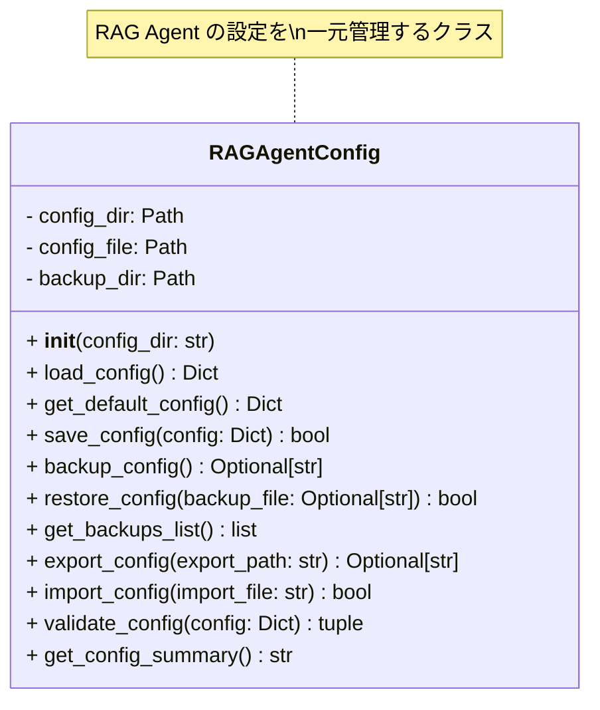
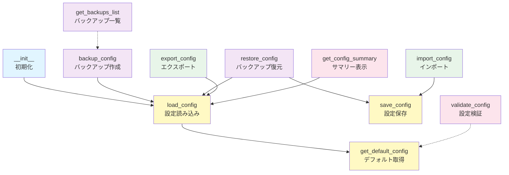
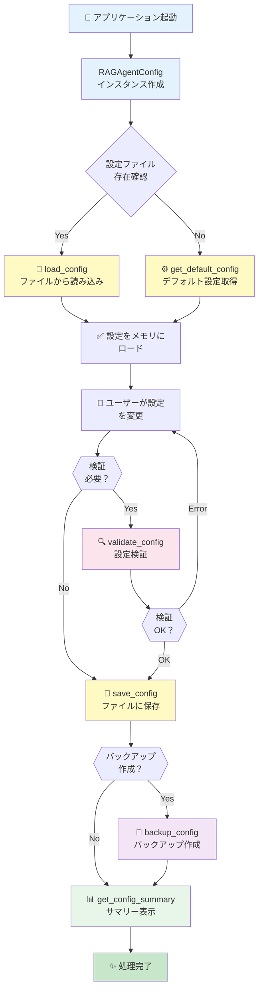
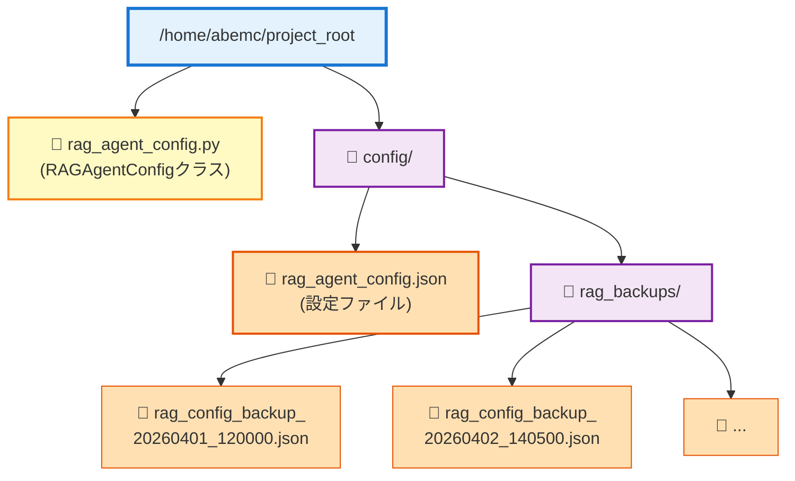
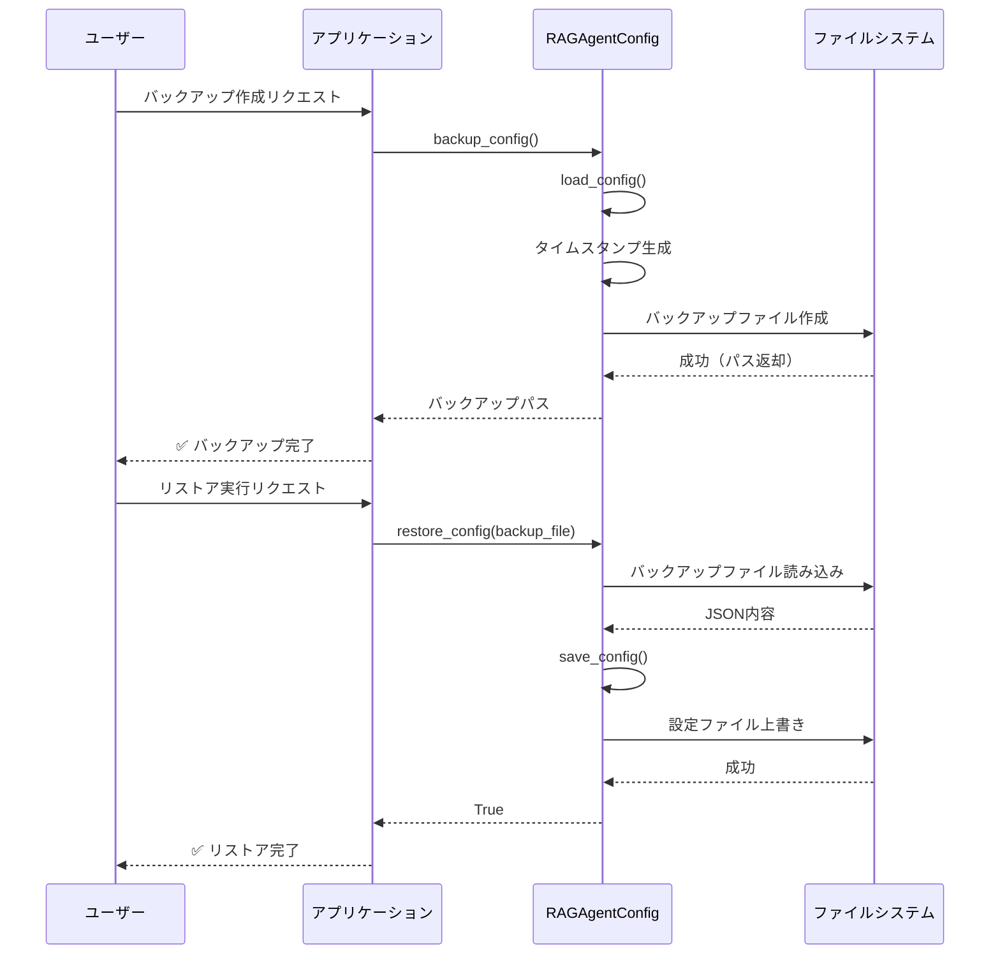
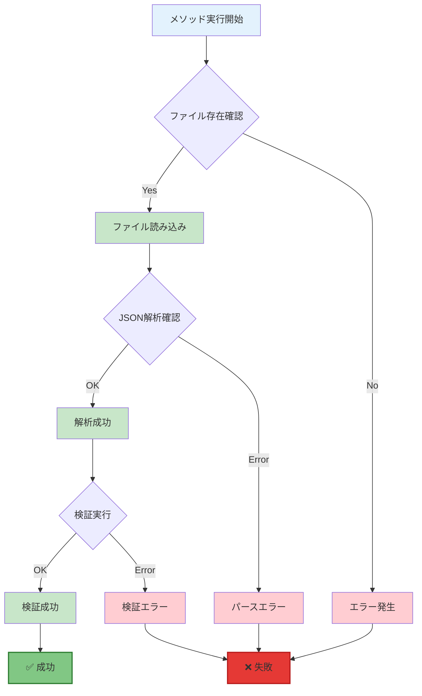
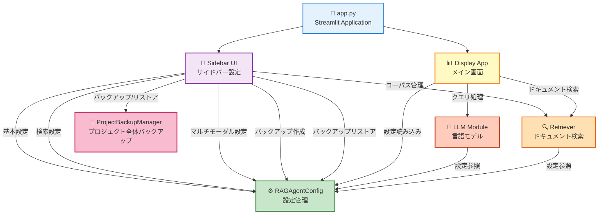
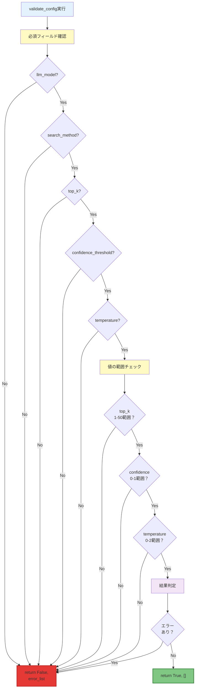

# RAGAgentConfig - 構成図とフロー図

## 1. クラス構造図

---

## 2. メソッドの依存関係図

---

## 3. 設定管理のライフサイクル

---

## 4. ファイルシステム構造

---

## 5. 設定値の流れ

```mermaid
graph LR
    User["👤 ユーザー"]
    UI["🖥️ UI/ダッシュボード"]
    App["📱 アプリケーション"]
    RAGConfig["⚙️ RAGAgentConfig"]
    FileSystem["💾 ファイルシステム"]
    JSON["📄 JSON設定ファイル"]
    
    User -->|設定を入力| UI
    UI -->|設定値をリクエスト| App
    App -->|save_config| RAGConfig
    RAGConfig -->|JSON形式で保存| FileSystem
    FileSystem -->|rag_agent_config.json| JSON
    
    JSON -->|JSON読み込み| FileSystem
    FileSystem -->|ファイル内容| RAGConfig
    RAGConfig -->|load_config| App
    App -->|設定値を表示| UI
    UI -->|設定を表示| User
    
    style User fill:#e1f5fe
    style UI fill:#f3e5f5
    style App fill:#fff9c4
    style RAGConfig fill:#c8e6c9
    style FileSystem fill:#ffccbc
    style JSON fill:#ffe0b2
```

---

## 6. バックアップ・リストア フロー

---

## 7. エラーハンドリング フロー

---

## 8. app.py との連携図

---

## 9. データフォーマット - デフォルト設定構造

```mermaid
graph TD
    Config["rag_agent_config.json"]
    
    Version["version: string<br/>1.0"]
    Created["created: datetime<br/>ISO形式"]
    
    LLM["llm_model: string<br/>GPT-4o"]
    SearchMethod["search_method: string<br/>ハイブリッド"]
    Language["language: string<br/>ja"]
    
    TopK["top_k: integer<br/>5"]
    Confidence["confidence_threshold: float<br/>0.7"]
    Categories["document_categories: list<br/>root, reports, guides"]
    
    Cache["enable_cache: boolean<br/>true"]
    CacheTTL["cache_ttl: integer<br/>3600"]
    MaxTokens["max_tokens: integer<br/>2000"]
    Temperature["temperature: float<br/>0.7"]
    
    SystemPrompt["system_prompt: string<br/>プロンプト定義"]
    Attribution["enable_source_attribution: boolean<br/>true"]
    FollowUp["enable_follow_up_questions: boolean<br/>true"]
    
    BackupLoc["backup_location: string<br/>/mnt/d/backups"]
    LastModified["last_modified: datetime<br/>ISO形式"]
    
    Config --> Version
    Config --> Created
    Config --> LLM
    Config --> SearchMethod
    Config --> Language
    Config --> TopK
    Config --> Confidence
    Config --> Categories
    Config --> Cache
    Config --> CacheTTL
    Config --> MaxTokens
    Config --> Temperature
    Config --> SystemPrompt
    Config --> Attribution
    Config --> FollowUp
    Config --> BackupLoc
    Config --> LastModified
    
    style Config fill:#c8e6c9,stroke:#2e7d32,stroke-width:2px
    style Version fill:#fff9c4
    style Created fill:#fff9c4
    style LLM fill:#ffe0b2
    style SearchMethod fill:#ffe0b2
    style Language fill:#ffe0b2
    style TopK fill:#ffccbc
    style Confidence fill:#ffccbc
    style Categories fill:#ffccbc
    style Cache fill:#f3e5f5
    style CacheTTL fill:#f3e5f5
    style MaxTokens fill:#f3e5f5
    style Temperature fill:#f3e5f5
    style SystemPrompt fill:#bbdefb
    style Attribution fill:#bbdefb
    style FollowUp fill:#bbdefb
    style BackupLoc fill:#c8e6c9
    style LastModified fill:#c8e6c9
```

---

## 10. 検証ロジック フロー

---

**図作成日**: 2026-04-26  
**バージョン**: 1.0
