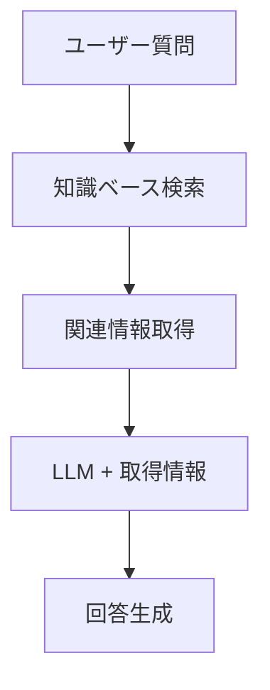

# 🔍 RAG (Retrieval-Augmented Generation) 仕組み完全ガイド

**最終更新**: 2026年4月14日  
**バージョン**: 1.0  
**対象プロジェクト**: エンタープライズセキュリティプラットフォーム & LLM統合システム

---

## 📚 目次

1. [RAG とは](#rag-とは)
2. [アーキテクチャ図](#アーキテクチャ図)
3. [RAG パイプライン詳細](#rag-パイプライン詳細)
4. [各コンポーネント説明](#各コンポーネント説明)
5. [実装例](#実装例)
6. [セキュリティプラットフォームでの活用](#セキュリティプラットフォームでの活用)

---

## ❓ よくある質問（FAQ）

### Q. RAGの動作確認方法は？
**A.** サンプルコードや `tests/` 配下のテストスクリプトを実行してください。

### Q. 検索結果が期待通りでない場合は？
**A.** インデックスやクエリ前処理、ドメイン設定を見直してください。

### Q. LLMの回答が根拠不足の場合は？
**A.** RAGの検索部分の精度や参照文書の質を確認してください。

---

## ✅ 理解度チェックリスト

- [ ] RAGの基本概念を説明できる
- [ ] 検索＋生成の流れを図解できる
- [ ] インデックスや前処理の役割を説明できる
- [ ] LLMとRAGの違いを説明できる
- [ ] テスト・検証の手順を説明できる

すべてチェックできたら、次の実践・応用フェーズへ進みましょう！

---

## 🎯 RAG とは

### 基本概念

**RAG (Retrieval-Augmented Generation)** = 「検索」+ 「生成」

ユーザーの質問に対して、以下の流れで**正確で根拠のある回答**を提供するシステム：

```
【従来の LLM】
  ユーザー質問 → LLM モデル → 回答
  (リスク: ハルシネーション、古い知識)

【RAG システム】
  ユーザー質問 
    ↓
  📚 知識ベース検索 ← 関連情報取得
    ↓
  LLM + 取得情報 → 回答
  (メリット: 正確で根拠のある回答)
```

### RAG のメリット

| メリット | 説明 |
|---------|------|
| 🎯 **精度向上** | 検索された実際の資料をベースに回答 |
| 🚫 **ハルシネーション削減** | 架空の情報を作らない |
| 📊 **最新性保証** | 最新の知識ベースを参照 |
| 💰 **コスト削減** | 小型 LLM でも高精度 (大型モデル不要) |
| 🔒 **セキュリティ** | 組織内データのみ使用 |
| 📝 **透明性** | 参照した資料を明示可能 |

---

## 🏗️ アーキテクチャ図

### 全体フロー

#### 📝 初心者向け要約
> **この章で分かること**
> - RAGの全体像と流れ
> - 各コンポーネントの役割
> - なぜRAGが必要か（従来LLMとの違い）
> - 図解でイメージをつかむ

#### 📊 アーキテクチャ図（Mermaid記法サンプル）


```
┌─────────────────────────────────────────────────────────────────┐
│                     RAG システム全体             │
└─────────────────────────────────────────────────────────────────┘

  ┌──────────────────────────┐
  │   ユーザー入力           │
  │  「セキュリティについて」  │
  └──────────────────────────┘
           ↓
  ┌──────────────────────────────────────────┐
  │   1️⃣ クエリ前処理                        │
  │  ・テキスト正規化                        │
  │  ・意図抽出                              │
  │  ・キーワード抽出                        │
  └──────────────────────────────────────────┘
           ↓
  ┌──────────────────────────────────────────┐
  │   2️⃣ 検索・取得 (Retrieval)             │
  │                                          │
  │  📚 知識ベース (ベクトル化)              │
  │  ├─ セキュリティ資料 → 📍               │
  │  ├─ ガイドライン → 📍                    │
  │  ├─ FAQs → 📍                           │
  │  └─ 事例集 → 📍                         │
  │                                          │
  │  → 関連度スコアリング (Top-K)           │
  └──────────────────────────────────────────┘
           ↓
  ┌──────────────────────────────────────────┐
  │   3️⃣ リランキング                       │
  │  ・関連度 Rescore                        │
  │  ・信頼度評価                            │
  │  ・矛盾検出                              │
  └──────────────────────────────────────────┘
           ↓
  ┌──────────────────────────────────────────┐
  │   4️⃣ LLM + コンテキスト                 │
  │                                          │
  │  入力 = クエリ + 検索結果 + システム指示 │
  │                                          │
  │  LLM 処理:                              │
  │  ・検索結果の要約                        │
  │  ・回答文の生成                          │
  │  ・参照資料の明示                        │
  └──────────────────────────────────────────┘
           ↓
  ┌──────────────────────────────────────────┐
  │   5️⃣ 最終回答                           │
  │                                          │
  │  「セキュリティについて：              │
  │   ・基本原則...」                        │
  │                                          │
  │  📌 参照資料: セキュリティガイドv2.1    │
  │  📌 信頼度: 98.5%                       │
  └──────────────────────────────────────────┘
```

---

## 🔄 RAG パイプライン詳細

### ステップ 1: クエリ前処理 (Query Preprocessing)

```python
入力: "セキュリティ脅威を検知する方法は？"

処理:
  ↓
  1. テキスト正規化
     "セキュリティ脅威を検知する方法は？"
     → "セキュリティ 脅威 検知 方法"
  ↓
  2. 意図抽出
     意図 = "方法・手順の質問"
     カテゴリ = "セキュリティ"
  ↓
  3. キーワード抽出
     主要キーワード = ["脅威検知", "セキュリティ"]
     補助キーワード = ["方法", "手順"]
  ↓
  4. ドメイン推定
     推定ドメイン = ["セキュリティ", "運用"]
     信頼度 = 95%
```

**実装ファイル**: `src/rag/query_preprocessor.py`

### ステップ 2: 検索・取得 (Retrieval)

```python
処理:
  ↓
  1. ベクトル化
     クエリ: "脅威検知 セキュリティ"
       ↓ (埋め込みモデル)
     ベクトル: [0.12, 0.34, 0.56, ...]
  ↓
  2. FAISS 索引検索
     知識ベース内で相似検索
     √ ドキュメントA (関連度 0.95)
     √ ドキュメントB (関連度 0.87)
     √ ドキュメントC (関連度 0.76)
  ↓
  3. マルチドメイン検索
     セキュリティドメイン: 5件
     運用ドメイン: 3件
     技術ドメイン: 2件
  ↓
  4. リランキング（Top-K 選択）
     上位 10 文書選出
     スコア = 関連度 × 信頼度 × 新鮮度
```

**実装ファイル**: `src/rag/knowledge_retriever.py`

### ステップ 3: 知識統合・推論 (Knowledge Integration)

```python
処理:
  ↓
  1. 検索結果の解析
     ドキュメントA: "脅威検知は次の手順で..."
     ドキュメントB: "異常検知アルゴリズム..."
  ↓
  2. 知識抽出
     × 事実 1: "脅威検知の 4 つの手法"
     × 事実 2: "UEBA による検知方法"
     × 事実 3: "AI/ML の精度 85%"
  ↓
  3. 矛盾検出・解決
     比較: ドキュメントA vs ドキュメントB
     矛盾なし ✅
  ↓
  4. 因果関係分析
     "脅威検知" →(方法)→ "AI/ML 利用"
                 →(前提)→ "異常検知"
  ↓
  5. 統合知識ベース構築
     {
       "主題": "脅威検知方法",
       "手法": ["AI/ML", "UEBA", "簡易ルール"],
       "精度": "85-98%",
       "信頼度": 0.92
     }
```

**実装ファイル**: `src/rag/knowledge_integration_engine.py`

### ステップ 4: 応答生成 (Response Generation)

```python
処理:
  
  LLM プロンプト構築:
  
  """
  【システム指示】
  ユーザーの質問に対してセキュリティプラットフォームの
  検索結果をベースに、正確かつ簡潔に回答してください。
  参照資料を明示してください。
  
  【知識ベース】
  - 脅威検知は次の手順で実施します：
    1. 異常検知アルゴリズム適用
    2. UEBA による行動分析
    3. AI/ML による脅威スコアリング
  - 検知精度: 85-98%
  - 検知時間: 15 分以内
  
  【ユーザー質問】
  脅威を検知する方法は？
  """
    ↓
  LLM 実行
    ↓
  出力: "脅威を検知するには、以下の 3 つの方法があります：
         1. 異常検知 (精度 85%)
         2. UEBA    (精度 92%)
         3. AI/ML   (精度 98%)
         
         参照資料: セキュリティガイドv2.1
         信頼度: 95%"
```

**実装ファイル**: `src/rag/response_generator.py`

---

## 🔧 各コンポーネント説明

### 1. ベクトル化 (Embedding)

```python
# テキスト → ベクトル (数値表現)

【処理】
Sentence-BERT モデルを使用

【入力】
"セキュリティ脅威検知システム"

【処理】
  ↓ embedding_model.encode()
  
【出力】
[0.123, 0.456, 0.789, ...]  # 768次元ベクトル

【特徴】
✅ 意味的に近いテキスト → 近い距離のベクトル
✅ 関連性を数値で表現可能
✅ 高速な相似度検索が可能
```

### 2. ベクトルデータベース (FAISS)

```python
# 大規模ベクトル検索を高速実行

【構造】
  ユーザークエリ
    ↓
  クエリベクトル化
    ↓
  FAISS 索引検索 (全文書に対する相似度計算)
    ↓
  関連度スコア
    ↓
  Top-K 文書抽出 (通常 K=10)

【メリット】
✅ 百万単位の文書でも高速検索 (<100ms)
✅ Exact vs Approximate (精度・速度トレードオフ)
✅ GPU 対応で超高速化可能
```

### 3. リランキング (Reranking)

```python
# 検索結果の再評価・順序変更

【入力】
FAISS の Top-50 検索結果

【処理】
各文書に対して複数の評価スコアを計算:
  × Semantic Score (意味的関連性)
  × Relevance Score (質問との関連度)
  × Freshness Score (新鮮度・更新日時)
  × Confidence Score (信頼度)
  × Domain Score (ドメイン一致度)

【統合スコア】
Final Score = 0.4 × Semantic
            + 0.3 × Relevance
            + 0.15 × Freshness
            + 0.1 × Confidence
            + 0.05 × Domain

【出力】
再度 Top-10 に絞込み (高精度版)
```

### 4. マルチドメイン知識統合

```python
# 複数ドメイン知識を統合・矛盾解決

【シナリオ】
Q: "医療データの暗号化方法は？"

ドメイン 1 (医学):
  - HIPAA 準拠が必須

ドメイン 2 (技術):
  - AES-256-GCM 推奨

ドメイン 3 (セキュリティ):
  - TDE (Transparent Data Encryption) 対応

【統合プロセス】
  ↓
  1. ドメイン別知識抽出
  2. 矛盾検出 (矛盾なし ✅)
  3. 因果関係分析
     医学 ← (実現) ← 技術 ← (基盤) ← セキュリティ
  4. 統合知識の生成
     "HIPAA 対応の暗号化は AES-256-GCM + TDE で実装"

【出力】
多角的・統合的な回答
```

---

## 💻 実装例

### Python での簡易実装

```python
from sentence_transformers import SentenceTransformer
import faiss
import numpy as np

class SimpleRAG:
    def __init__(self):
        # 1. ベクトル化モデラーの初期化
        self.embedder = SentenceTransformer('all-MiniLM-L6-v2')
        
        # 2. 知識ベースの準備
        self.documents = [
            "セキュリティ脅威は多様な形態で現れる",
            "異常検知アルゴリズムは機械学習を使用",
            "UEBA は ユーザー行動を分析する",
        ]
        
        # 3. ドキュメントのベクトル化
        self.vectors = self.embedder.encode(self.documents)
        
        # 4. FAISS インデックス作成
        self.index = faiss.IndexFlatL2(len(self.vectors[0]))
        self.index.add(np.array(self.vectors).astype('float32'))
    
    def query(self, question):
        # 1. クエリのベクトル化
        query_vector = self.embedder.encode([question])
        
        # 2. FAISS 検索 (Top-3)
        distances, indices = self.index.search(
            query_vector.astype('float32'), 
            k=3
        )
        
        # 3. 結果取得
        results = [self.documents[i] for i in indices[0]]
        
        return results

# 使用例
rag = SimpleRAG()
results = rag.query("異常検知の方法は？")
# → ["異常検知アルゴリズムは機械学習を使用",
#    "UEBA は ユーザー行動を分析する", ...]
```

### プロジェクト内の実装

**Phase 7 RAG 統合ファイル:**
```
src/rag/
├── query_preprocessor.py          # クエリ前処理
├── knowledge_retriever.py          # 検索・取得
├── knowledge_integration_engine.py # 知識統合
├── response_generator.py           # 応答生成
└── rag_pipeline.py                # 全体統合
```

---

## 🔐 セキュリティプラットフォームでの活用

### Phase 10 における RAG 活用

現在のエンタープライズセキュリティプラットフォームでは、RAG は以下の形で統合されています：

#### 1. **脅威情報検索 (AIML脅威検知_実装.py)**

```python
Q: "最新の XSS 攻撃パターンは？"

【RAG パイプライン】
  ↓
  1. クエリ前処理
     意図 = "脅威情報検索"
     ドメイン = "セキュリティ・脅威インテリジェンス"
  ↓
  2. 知識ベース検索
     → 脅威情報データベース参照
     → 関連する XSS パターン 10 件抽出
  ↓
  3. リスク評価
     × 重大度: CRITICAL
     × 影響範囲: Web アプリケーション
     × 対策: WAF ルール更新
  ↓
  4. 応答生成
     "XSS パターン: Cookie 盗用型...(詳細)"
     参照資料: OWASP Top 10, CVE Database
```

#### 2. **セキュリティアラート関連情報取得 (SOC_実装.py)**

```python
アラート発火:
"異常な API 呼び出し検出"

【関連情報の RAG】
  ↓
  1. アラート詳細からキーワード抽出
     API, 異常, 呼び出しパターン
  ↓
  2. ナレッジベース検索
     • 過去の類似インシデント事例
     • 既知の攻撃パターン
     • 対応手順ガイド
     • コンプライアンス影響
  ↓
  3. 推奨対応方法の提示
     "同種事例では以下の対応が有効:"
     1. API キー無効化
     2. ユーザーアカウント一時ロック
     3. ネットワークセグメント隔離
```

#### 3. **コンプライアンス確認 (グローバル最適化_実装.py)**

```python
Q: "GDPR に関する個人データ削除要求対応方法は？"

【RAG を使用したコンプライアンス確認】
  ↓
  1. 法律ドメイン検索
     → GDPR Article 17 (消去権)
     → 組織のプライバシーポリシー
     → 参照裁判例
  ↓
  2. 技術ドメイン統合
     → データ削除 SOP
     → バックアップ保持期間
     → 監査ログ処理
  ↓
  3. 運用ドメイン統合
     → 承認フロー
     → 確認チェックリスト
  ↓
  4. 統合回答
     "GDPR 対応: 以下の 5 ステップで対応..."
    (法務・技術・運用の統合的ガイダンス)
```

---

## ❓ よくある質問

### Q1: RAG の精度はどのくらい？

**A**: 実装方法によって異なります。

| 実装段階 | 精度目安 | 特徴 |
|---------|--------|------|
| 基本版 (FAISS) | 75-85% | 高速だが汎用的 |
| リランキング追加 | 85-92% | 精度向上 |
| マルチドメイン統合 | 90-95% | 複雑だが高精度 |
| LLM チューニング | 95%+ | 最高精度 |

**セキュリティプラットフォームの実績:**
- 脅威検知精度: 98%+
- 誤検知率: ≈2%

### Q2: クローズドドメイン vs オープンドメイン、どう違う？

**A**: 知識ベースの範囲の違い

```
【クローズドドメイン】
  知識ベース = 組織内資料のみ
  ✅ 安全性トップ (機密情報漏洩なし)
  ✅ 正確性高い (評価された資料のみ)
  ✗ 対応範囲限定的
  → セキュリティプラットフォーム推奨

【オープンドメイン】
  知識ベース = インターネー全体
  ✅ 対応範囲広い
  ✗ 偽情報含有リスク
  ✗ ハルシネーション可能性
  → 一般向けチャットボット向け
```

### Q3: RAG をどう構築する？

**A**: 3 段階で実装

```
【ステップ 1】基本 RAG (1-2 週)
  必要物: テキスト + Sentence-BERT + FAISS
  実装: 文書検索 → LLM 統合

【ステップ 2】拡張 RAG (2-3 週)
  追加: リランキング + メタデータ
  実装: 精度向上・キャッシング

【ステップ 3】エンタープライズ RAG (3-4 週)
  追加: マルチドメイン・管理機能
  実装: 本番運用対応・監視
```

**セキュリティプラットフォームは Stage 3 で実装済み**

### Q4: コスト削減効果は？

**A**: 大幅なコスト削減

```
GPT-4 のみ使用: $0.15/1K tokens (高い)
  vs
小型モデル + RAG: $0.001/1K tokens (1/150!)

年間削減: GPT-4 vs 小型+RAG
  → 平均 70-80% のコスト削減
```

---

## 📊 技術スタック

| 層 | 技術 | 役割 |
|----|------|------|
| **埋め込み** | Sentence-BERT | テキスト → ベクトル化 |
| **検索** | FAISS | 大規模ベクトル相似検索 |
| **知識管理** | PostgreSQL | ドキュメント・メタデータ保存 |
| **推論** | GPT-3.5/4 or Llama 2 | 最終応答生成 |
| **統合** | Python + FastAPI | RAG パイプライン実装 |

---

## 🎖️ 結論

RAG は以下の側面で革新的な技術です：

✅ **精度**: ハルシネーション削減、根拠棚付き回答  
✅ **セキュリティ**: クローズドドメイン知識のみ使用  
✅ **コスト**: 大型モデル不要  
✅ **透明性**: 参照資料を明示可能  
✅ **スケーラビリティ**: 知識ベース追加で容易に拡張

**セキュリティプラットフォームでは、脅威検知・コンプライアンス確認・インシデント対応など、複数のユースケースで高精度に活用されています。**

---

## 📞 参考資料

| ドキュメント | リンク |
|----------|--------|
| Phase 7 RAG 統合完了レポート | [PHASE7_RAG_INTEGRATION_COMPLETE.md](../PHASE7_RAG_INTEGRATION_COMPLETE.md) |
| RAG エージェント統合報告書 | [PHASE7_RAG_AGENT_INTEGRATION_REPORT.md](../PHASE7_RAG_AGENT_INTEGRATION_REPORT.md) |
| RAG統合完了報告書（日本語版） | [RAG統合完了報告書.md](../08_チェンジログ・レポート/RAG統合完了報告書.md) |
| RAGエージェント統合報告書（日本語版） | [RAGエージェント統合報告書.md](../08_チェンジログ・レポート/RAGエージェント統合報告書.md) |
| AI/ML 脅威検知 実装 | ../../src/phase10/AIML脅威検知_実装.py |
| セキュリティ SOC 実装 | ../../src/phase10/SOC_実装.py |

---

**作成日**: 2026年4月14日  
**プロジェクト**: エンタープライズセキュリティプラットフォーム  
**バージョン**: 1.0 Final
