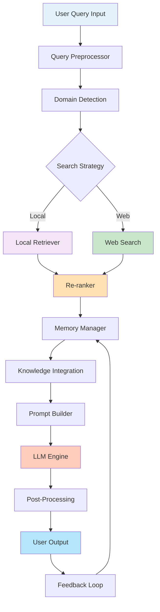
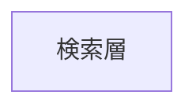

# RAGシステム全体フロー

## 概要
ユーザークエリから最終出力までの完全なパイプラインを表示します。

## 処理フロー説明

1. **入力処理**: ユーザークエリを受け取る
2. **クエリ前処理**: ドメイン検出と文脈抽出
3. **検索戦略決定**: ローカル/Web検索の分岐
4. **検索実行**: FAISS/Web APIで検索
5. **再ランキング**: 結果スコアを正規化
6. **メモリ検索**: 過去の会話履歴を検索
7. **知識融合**: マルチドメイン知識を統合
8. **プロンプト構築**: 最終プロンプトを生成
9. **LLM推論**: モデルで回答を生成
10. **後処理**: 出力をクリーンアップ
11. **フィードバック**: ユーザーフィードバックを収集して学習

## キーポイント

- マルチソース検索対応
- 適応的な検索戦略
- 継続的学習メカニズム
- ドメインコンテキスト保持

## 検索層

