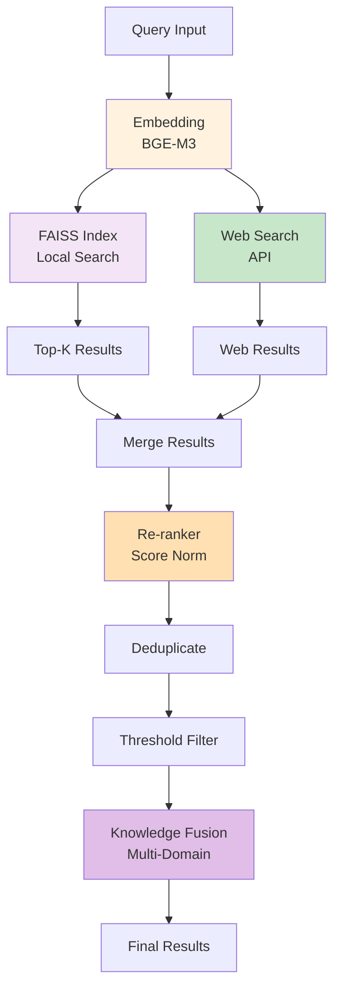

# 検索層の詳細構造

## 概要
マルチソース検索の内部メカニズムを詳細に表示します。

## コンポーネント説明

### Local Retriever
- **FAISS Index**: ベクトル検索エンジン
- **Corpus Manager**: ドキュメント管理
- **Embedding Model**: BGE-M3で埋め込み生成

### Web Search
- **Online Query**: インターネット検索
- **Result Aggregation**: 結果の集約

### Re-ranking & Filtering
- **Score Normalization**: スコアを0-1に正規化
- **Duplicate Removal**: 重複を除去
- **Threshold Filtering**: 閾値以下は除外

### Knowledge Fusion
- **Multi-Domain Recognition**: ドメイン認識
- **Context Merging**: 文脈統合

## パフォーマンス指標

- ✅ FAISS検索: O(log N)
- ✅ Re-ranking: O(M log M) (M=候補数)
- ✅ 推奨Top-K: 5-10
