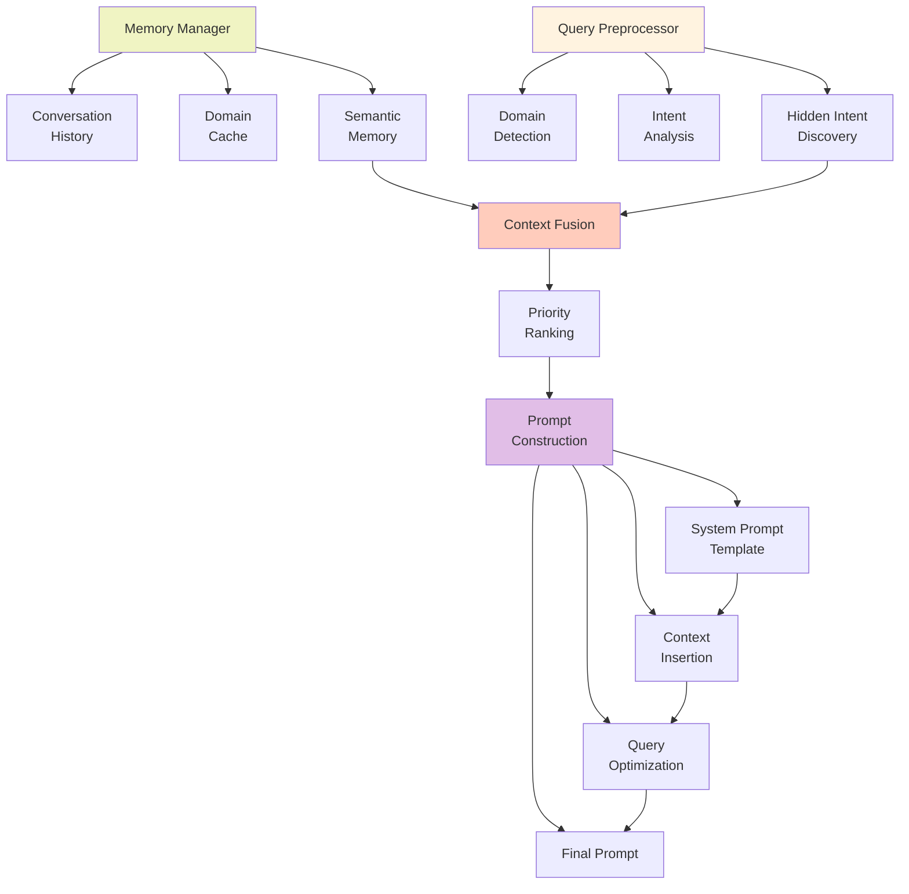

# メモリ & コンテキスト管理層

## 概要
状態保持と文脈形成のメカニズムを表示します。

## コンポーネント説明

### Memory Manager
- **Conversation History**: 過去の会話を検索
- **Domain Context Cache**: ドメイン別情報をキャッシュ
- **Semantic Memory**: セマンティック類似度で記憶を検索

### Query Preprocessor
- **Domain Detection**: クエリから推測ドメイン抽出
- **Intent Analysis**: ユーザーの意図を分析
- **Hidden Intent**: 明示されていない意図を発見

### Context Fusion
- **Merged Domain Info**: ドメイン情報を統合
- **Intent-aware Filter**: 意図に基づいてドキュメント選別
- **Priority Ranking**: 優先度付け

### Prompt Construction
- **System Prompt Template**: システムプロンプトテンプレート
- **Context Insertion**: 検索結果をプロンプトに挿入
- **Query Rewrite**: クエリを最適化
- **Final Prompt**: 最終的なプロンプト

## メモリ戦略

- ✅ 会話履歴: 最新50件保持
- ✅ ドメイン情報: LRUキャッシュ
- ✅ セマンティック検索: Top-5結果返却
