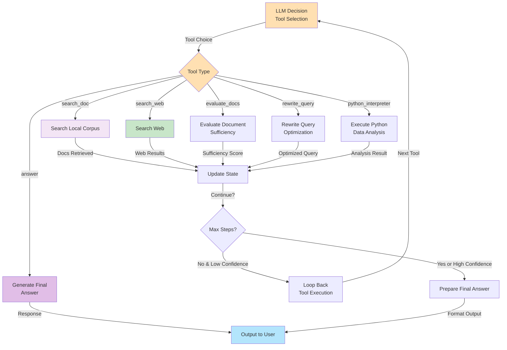

# LLM推論とツール実行ループ

## 概要
適応的なツール選択と実行メカニズムを表示します。

## 利用可能なツール

### 1. search_doc
ローカルコーパスから関連ドキュメントを検索
- 入力: クエリ
- 出力: Top-K ドキュメント

### 2. search_web
Webから最新情報を検索
- 入力: クエリ
- 出力: Webリンク + スニペット

### 3. evaluate_docs
現在のドキュメントが質問に答えるのに十分か評価
- 入力: 質問 + ドキュメント
- 出力: 十分性スコア (0-1)

### 4. rewrite_query
クエリをより効果的に書き直す
- 入力: オリジナルクエリ
- 出力: 最適化されたクエリ

### 5. python_interpreter
Pythonコードを実行してデータ分析
- 入力: Pythonコード
- 出力: 実行結果

### 6. answer
最終回答を生成
- 入力: 質問 + ドキュメント
- 出力: 最終回答

## 実行ループの特徴

- ✅ 最大ステップ制限: 10ステップ
- ✅ 低信頼度時は再試行
- ✅ 自動ツール選択
- ✅ 状態管理で無限ループ防止
