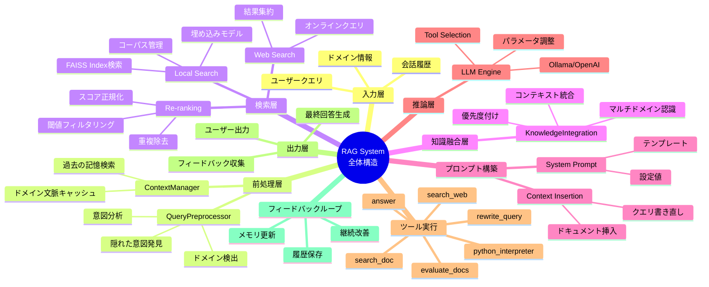

# RAG全体のマインドマップ

## 概要
RAGシステムを9層の階層構造として表示します。

## 9層の構造詳細

| 層 | 役割 | キーコンポーネント |
|---|----|------------------|
| 1. 入力層 | クエリとコンテキスト受け取り | User I/O |
| 2. 前処理層 | ドメイン・意図分析 | QueryPreprocessor |
| 3. 検索層 | マルチソース検索 | Retriever, Web API |
| 4. 知識融合層 | ドメイン統合 | KnowledgeIntegration |
| 5. プロンプト構築 | LLM用プロンプト生成 | PromptBuilder |
| 6. 推論層 | LLM実行 | LLM Engine |
| 7. ツール実行 | 動的ツール選択・実行 | 6種類のツール |
| 8. 出力層 | 回答生成・出力 | Formatter |
| 9. フィードバック | 学習と改善 | Memory Update |

## システムの特徴

- ✅ 9層の明確な責務分離
- ✅ 各層で異なる処理を実行
- ✅ 層間のデータ流通
- ✅ フィードバックループで継続改善
