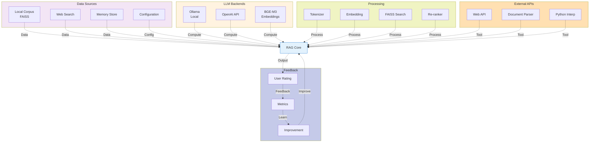

# 外力（External Forces）の全体構造

## 概要
RAGシステムへの全入力・依存性を表示します。

## 外力の分類

### データ外力 (Data Forces)
- **Local Corpus**: ローカルコーパス (FAISS)
- **Web Search**: インターネット情報
- **Memory Store**: 会話履歴
- **Configuration**: システム設定

### 計算外力 (Computation Forces)
- **Ollama**: ローカルLLMモデル
- **OpenAI API**: クラウドLLMサービス
- **BGE-M3**: 埋め込みモデル

### 処理外力 (Functional Forces)
- **Tokenizer**: テキスト分割
- **Embedding**: ベクトル生成
- **FAISS**: ベクトル検索
- **Re-ranker**: スコア最適化

### API & Tool外力
- **Web API**: Web検索・取得
- **Document Parser**: PDF/画像処理
- **Python Interpreter**: データ分析実行

### フィードバック外力
- **User Feedback**: ユーザー評価
- **Metrics Tracking**: パフォーマンス計測
- **Self-Improvement**: 自動改善

## 依存関係マトリックス

| 外力 | 重要度 | 代替手段 | 冗長性 |
|-----|--------|--------|-------|
| LLM Backend | 🔴必須 | Ollama ↔ OpenAI | ✅ あり |
| Embedding Model | 🔴必須 | BGE-M3 固定 | ❌ なし |
| Local Corpus | 🟡重要 | Web Search | ✅ あり |
| FAISS Search | 🔴必須 | 線形検索 | ✅ あり |
| Web API | 🟡重要 | キャッシュ利用 | ✅ あり |
