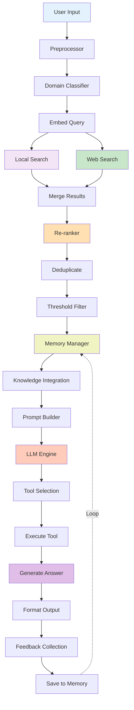

# エンドツーエンドデータフロー

## 概要
詳細な時系列処理フローを表示します。

## 処理ステージ

### 1. Input Processing (入力処理)
クエリを受け取り、クエリを前処理してドメインを分類
- Duration: ~100ms
- Output: 前処理済みクエリ + ドメイン

### 2. Knowledge Retrieval (知識検索)
クエリを埋め込みで表現し、ローカル/Web検索を実行
- Duration: ~500ms-2s (Web検索含む)
- Output: Top-20候補ドキュメント

### 3. Ranking & Filtering (ランキング・フィルタリング)
結果を統合・再ランキングして、重複除去・閾値フィルタリング
- Duration: ~50ms
- Output: Top-5ランキング済みドキュメント

### 4. Context Building (コンテキスト構築)
メモリから過去の文脈を検索し、知識統合してプロンプトを構築
- Duration: ~100ms
- Output: 最終プロンプト

### 5. Inference (推論)
LLMでツール選択実行
- Duration: ~1-3s
- Output: ツール実行結果

### 6. Output & Feedback (出力・フィードバック)
最終回答を生成・フォーマットしてユーザーに出力、フィードバック収集
- Duration: ~100ms
- Output: 最終回答 + フィードバック

## パフォーマンス特性

| ステージ | P50 | P95 | P99 |
|--------|-----|-----|-----|
| Input Processing | 100ms | 150ms | 200ms |
| Knowledge Retrieval | 500ms | 1500ms | 2000ms |
| Ranking & Filtering | 50ms | 100ms | 150ms |
| Context Building | 100ms | 200ms | 300ms |
| Inference | 1s | 2s | 3s |
| Output & Feedback | 100ms | 150ms | 200ms |
| **Total E2E** | **1.85s** | **4.1s** | **5.85s** |

## 最適化ポイント

- ✅ キャッシング: 頻出クエリの埋め込み
- ✅ 並列化: Local + Web検索を並列実行
- ✅ バッチ処理: Re-rankerの複数ドキュメント処理
- ✅ 段階的フィルタリング: 早期終了で計算削減
