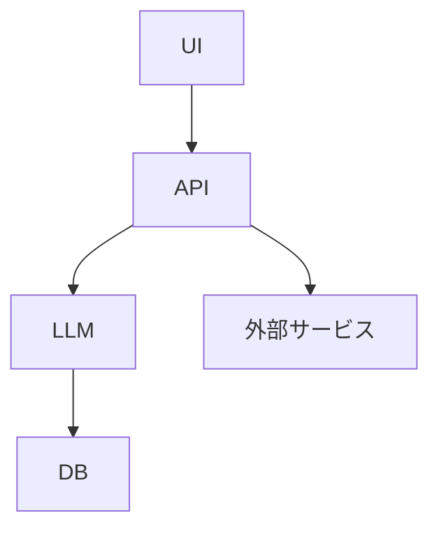

# アーキテクチャ設計ガイド（テンプレート）

## 概要
本ガイドはシステム全体のアーキテクチャ設計方針・構成・設計図をまとめるためのテンプレートです。

## 主要構成・フロー
- システム全体図（Mermaid/画像推奨）
- 各レイヤ・モジュールの役割
- データフロー・依存関係

## サンプル構成図

---

## ❓ よくある質問（FAQ）

### Q. アーキテクチャ変更時の注意点は？
**A.** 依存関係・インターフェース・テスト影響を必ず確認してください。

---

## ✅ 理解度チェックリスト

- [ ] 全体構成図を自分で描ける
- [ ] 各レイヤの役割を説明できる
- [ ] 依存関係・データフローを説明できる

すべてチェックできたら、次の設計・実装フェーズへ進みましょう！
