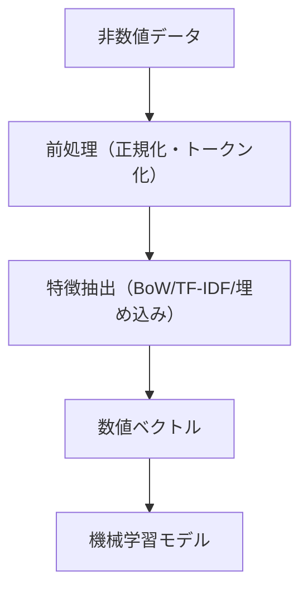

# ベクトル化完全ガイド

---

## 📝 初心者向け要約
> **このドキュメントで分かること**
> - ベクトル化の目的と全体像
> - 主要な手法と流れ（図解付き）
> - どんな場面で使うと効果的か
> - よくある質問・つまずきポイント

### 📊 ベクトル化全体フロー図（Mermaid記法）


> データをコンピュータが処理できる数値表現に変換するプロセスの全体像

---

## 📋 目次

1. [ベクトル化とは](#ベクトル化とは)
2. [数学的基礎](#数学的基礎)
3. [NLPでのベクトル化](#nlpでのベクトル化)
4. [実装パターン](#実装パターン)
5. [応用と活用](#応用と活用)
6. [ベストプラクティス](#ベストプラクティス)

---

## ベクトル化とは

### 定義

**ベクトル化**とは、非数値データ（テキスト、画像、カテゴリなど）を数値ベクトル（数字の配列）に変換するプロセスです。

```
"hello world" → [0.2, -0.5, 0.8, ..., 0.1]  # 埋め込みベクトル
```

### なぜベクトル化が必要か？

- **機械学習モデル**: ニューラルネットワークは数値入力を要求
- **類似度計算**: ベクトル間の距離で意味的類似性を測定
- **次元削減**: 高次元データから特徴を抽出
- **計算効率**: 数値演算はテキスト操作より高速

### ベクトル化の全体フロー

```
非数値データ
    ↓
前処理（正規化、トークン化）
    ↓
特徴抽出（Bag-of-Words, TF-IDF, 埋め込みなど）
    ↓
数値ベクトル
    ↓
機械学習モデル
```

---

## 数学的基礎

### ベクトル空間の概念

#### 1. 1次元ベクトル

```
v = [5]
```
- 数直線上の単一の点
- スカラー値とも呼ぶ

#### 2. 2次元ベクトル

```
v = [3, 4]
      ↑   ↑
      x   y
```

可視化：
```
     y
     ↑
   4 |    ●
     |   /
   2 |  /
     | /
   0 |────→ x
     0  2  3
```

長さ（ノルム）：$||v|| = \sqrt{3^2 + 4^2} = 5$

#### 3. N次元ベクトル

```
v = [v₁, v₂, v₃, ..., vₙ]
```

例：テキストの埋め込みベクトル（768次元）
```
"happy" → [0.23, -0.51, 0.87, ..., -0.14]  # 768個の数値
```

### 重要な概念

#### ノルム（ベクトルの大きさ）

**L2ノルム（ユークリッドノルム）**：
$$||v||_2 = \sqrt{v_1^2 + v_2^2 + \cdots + v_n^2}$$

```python
import numpy as np
v = np.array([3, 4])
norm = np.linalg.norm(v)  # 5.0
```

**L1ノルム（マンハッタンノルム）**：
$$||v||_1 = |v_1| + |v_2| + \cdots + |v_n|$$

#### 正規化（Normalization）

ベクトルの大きさを1に統一する操作：

$$\hat{v} = \frac{v}{||v||_2}$$

```python
normalized_v = v / np.linalg.norm(v)  # [0.6, 0.8]
```

#### 類似度尺度

**コサイン類似度**：

$$\cos(\theta) = \frac{v_1 \cdot v_2}{||v_1|| \cdot ||v_2||}$$

特徴：
- 値域：-1～1
- 1：同一方向（完全に類似）
- 0：直交（無関係）
- -1：反対方向（完全に異なる）

```python
# 計算例
v1 = np.array([1, 0, 0])
v2 = np.array([1, 1, 0])

dot_product = np.dot(v1, v2)  # 1
norms = np.linalg.norm(v1) * np.linalg.norm(v2)  # 1 * √2
cosine_sim = dot_product / norms  # 0.707
```

**ユークリッド距離**：

$$d(v_1, v_2) = \sqrt{(v_1 - v_2) \cdot (v_1 - v_2)}$$

---

## NLPでのベクトル化

### 1. One-Hot Encoding

最もシンプルな方法。

#### 概念

語彙内の単語を一意にエンコード：

```
語彙: ["cat", "dog", "bird"]
      ↓
"cat"  → [1, 0, 0]
"dog"  → [0, 1, 0]
"bird" → [0, 0, 1]
```

#### 特徴

- ✅ 実装が簡単
- ✅ 計算が高速
- ❌ 高次元スパース（ほぼゼロ）
- ❌ 単語間の関係性を捉えられない
- ❌ 語彙外単語に対応困難

#### 実装例

```python
class OneHotEncoder:
    def __init__(self, vocab):
        self.word2id = {word: idx for idx, word in enumerate(vocab)}
        self.vocab_size = len(vocab)
    
    def encode(self, word):
        vec = np.zeros(self.vocab_size)
        if word in self.word2id:
            vec[self.word2id[word]] = 1
        return vec

encoder = OneHotEncoder(["cat", "dog", "bird"])
print(encoder.encode("cat"))  # [1. 0. 0.]
```

### 2. Bag-of-Words (BoW)

テキスト全体の単語の出現頻度を集計。

#### 概念

```
テキスト: "I love cats. I love dogs."
         ↓
["I", "love", "cats", "I", "love", "dogs"]
         ↓
単語ベクトル: [2, 2, 1, 1]  # I(2), love(2), cats(1), dogs(1)
```

#### 特徴

- ✅ テキストの内容を反映
- ✅ 計算が高速
- ❌ 単語の順序を失う
- ❌ スパースで高次元

#### 実装例

```python
from collections import Counter

def bag_of_words(text, vocab):
    """テキストをBoWベクトルに変換"""
    tokens = text.lower().split()
    word_counts = Counter(tokens)
    
    vec = np.zeros(len(vocab))
    for word, count in word_counts.items():
        if word in vocab:
            idx = vocab.index(word)
            vec[idx] = count
    return vec

vocab = ["i", "love", "cats", "dogs"]
text = "i love cats i love dogs"
bow = bag_of_words(text, vocab)
print(bow)  # [2. 2. 1. 1.]
```

### 3. TF-IDF（Term Frequency-Inverse Document Frequency）

単語の重要度を考慮した特徴抽出。

#### 概念

$$\text{TF-IDF}(t, d) = \text{TF}(t, d) \times \text{IDF}(t)$$

**TF（語頻度）**：
$$\text{TF}(t, d) = \frac{\text{単語tが文書dに出現する回数}}{\text{文書dの総単語数}}$$

**IDF（逆文書頻度）**：
$$\text{IDF}(t) = \log\left(\frac{\text{全文書数}}{\text{単語tを含む文書数}}\right)$$

#### 直感的理解

- 頻繁に出現する単語 → 情報量が少ない（IDF低）
- レアな単語 → 情報量が多い（IDF高）
- 文書内で頻出の単語 → TF高

D2: "python programming is fun"
#### 実装例

```python
from collections import Counter


    """テキストをBoWベクトルに変換"""

---

## ❓ よくある質問（FAQ）

### Q. ベクトル化の動作確認方法は？
**A.** サンプルコードや `tests/` 配下のテストスクリプトを実行してください。

### Q. ベクトルの次元数が合わない場合は？
**A.** モデルや前処理の設定を見直し、同じ次元数で揃えてください。

### Q. 類似度計算がうまくいかない場合は？
**A.** 正規化やコサイン類似度の計算式を確認してください。

---

## ✅ 理解度チェックリスト

- [ ] ベクトル化の基本概念を説明できる
- [ ] BoW/TF-IDF/埋め込みの違いを説明できる
- [ ] 正規化や類似度計算の意味を説明できる
- [ ] 実装例を自分で動かせる

すべてチェックできたら、次の実践・応用フェーズへ進みましょう！
"python"は2/3のドキュメントに出現 → IDF = log(3/2) ≈ 0.405
"is"は3/3のドキュメントに出現 → IDF = log(3/3) = 0

結果："is"は特定性が低い → TF-IDF値が低い
```

#### 実装例

```python
from sklearn.feature_extraction.text import TfidfVectorizer

documents = [
    "python is great",
    "python programming is fun",
    "machine learning is important"
]

vectorizer = TfidfVectorizer()
tfidf_matrix = vectorizer.fit_transform(documents)

print(f"形状: {tfidf_matrix.shape}")  # (3, 7)
print(f"語彙: {vectorizer.get_feature_names_out()}")
```

### 4. Word Embeddings（埋め込みベクトル）

文脈を学習した密集ベクトル。

#### Word2Vec

**Skip-Gram モデル**：
```
入力：["the", "quick", "brown", "fox"]
目標単語："quick"
文脈ウィンドウ：2

訓練：
- "the" → "quick"を予測
- "brown" → "quick"を予測
```

**CBOW（Continuous Bag of Words）**：
```
入力：["the", "brown"]（文脈）
目標単語："quick"（予測対象）
```

#### 特徴

- ✅ 密集ベクトル（少ない次元で多くの情報）
- ✅ 単語の意味関係を保持
  ```
  "king" - "man" + "woman" ≈ "queen"
  ```
- ✅ 計算効率が良い

#### 実装例

```python
from gensim.models import Word2Vec

sentences = [
    ["the", "quick", "brown", "fox"],
    ["jumps", "over", "the", "lazy", "dog"],
    ["machine", "learning", "is", "important"]
]

model = Word2Vec(sentences, vector_size=100, window=5, min_count=1)

# 単語ベクトル取得
vec_quick = model.wv['quick']  # [100次元のベクトル]

# 類似単語検索
similar = model.wv.most_similar('quick', topn=3)
print(similar)  # [('fox', 0.xx), ('brown', 0.yy), ...]
```

#### GloVe（Global Vectors）

Word2Vecの改善版。グローバル統計情報を活用。

$$\text{GloVe} = \log(\text{共起確率行列}) + \text{局所文脈ウィンドウ}$$

特徴：
- Word2Vecより計算量が少ない
- より安定した埋め込み
- より一般的で再利用可能

### 5. BERT/Transformer埋め込み

文脈に応じた動的な埋め込み。

#### 概念

```
入力1: "bank account"
"bank" → [ベクトル1]  # 金融機関の意

入力2: "river bank"
"bank" → [ベクトル2]  # 河岸の意
```

同じ単語でも文脈に応じて異なるベクトルを出力。

#### 特徴

- ✅ 文脈を完全に反映
- ✅ 多言語対応
- ✅ 下流タスクで高精度
- ❌ 計算量が多い

#### 実装例

```python
from transformers import AutoTokenizer, AutoModel
import torch

model_name = "bert-base-uncased"
tokenizer = AutoTokenizer.from_pretrained(model_name)
model = AutoModel.from_pretrained(model_name)

text = "I love natural language processing"
tokens = tokenizer(text, return_tensors="pt")
outputs = model(**tokens)

embeddings = outputs.last_hidden_state  # [1, tokens, 768]
sentence_embedding = embeddings.mean(dim=1)  # [1, 768]
print(f"埋め込み次元: {sentence_embedding.shape}")  # [1, 768]
```

---

## 実装パターン

### パターン1: テキスト → 単語埋め込み → 文章埋め込み

```python
import numpy as np
from transformers import AutoTokenizer, AutoModel
import torch

class TextVectorizer:
    """テキストをベクトル化するクラス"""
    
    def __init__(self, model_name="bert-base-uncased"):
        self.tokenizer = AutoTokenizer.from_pretrained(model_name)
        self.model = AutoModel.from_pretrained(model_name)
    
    def vectorize(self, text, pooling_method='mean'):
        """テキストを埋め込みベクトルに変換"""
        
        # トークン化
        tokens = self.tokenizer(
            text,
            return_tensors="pt",
            truncation=True,
            max_length=512
        )
        
        # モデルに通す
        with torch.no_grad():
            outputs = self.model(**tokens)
        
        # 最後の隠れ層を取得
        last_hidden_state = outputs.last_hidden_state  # [1, seq_len, 768]
        
        # プーリング（複数トークンを1ベクトルに）
        if pooling_method == 'mean':
            # パディング位置を除く平均
            attention_mask = tokens['attention_mask'].unsqueeze(-1)
            masked = last_hidden_state * attention_mask
            embeddings = masked.sum(dim=1) / attention_mask.sum(dim=1)
        elif pooling_method == 'cls':
            # [CLS]トークン（最初のトークン）を使用
            embeddings = last_hidden_state[:, 0, :]
        
        return embeddings.numpy()[0]

# 使用例
vectorizer = TextVectorizer()
vec1 = vectorizer.vectorize("I love machine learning")
vec2 = vectorizer.vectorize("I enjoy deep learning")

# 類似度計算
cosine_sim = np.dot(vec1, vec2) / (np.linalg.norm(vec1) * np.linalg.norm(vec2))
print(f"類似度: {cosine_sim:.3f}")
```

### パターン2: カテゴリデータのベクトル化

```python
import numpy as np

class CategoricalVectorizer:
    """カテゴリデータを数値ベクトルに変換"""
    
    def __init__(self, categories):
        self.categories = categories
        self.category2id = {cat: idx for idx, cat in enumerate(categories)}
        self.id2category = {idx: cat for idx, cat in enumerate(categories)}
    
    def one_hot(self, category):
        """One-Hot encoding"""
        vec = np.zeros(len(self.categories))
        vec[self.category2id[category]] = 1
        return vec
    
    def label_encoding(self, category):
        """ラベルエンコーディング（単純な数値）"""
        return self.category2id[category]

# 使用例
vectorizer = CategoricalVectorizer(['cat', 'dog', 'bird'])

print("One-Hot:", vectorizer.one_hot('cat'))  # [1. 0. 0.]
print("Label:", vectorizer.label_encoding('dog'))  # 1
```

### パターン3: 数値データの正規化

```python
import numpy as np
from sklearn.preprocessing import StandardScaler, MinMaxScaler

class NumericalVectorizer:
    """数値データを正規化してベクトル化"""
    
    def __init__(self, method='standard'):
        """
        method: 'standard' (z正規化) または 'minmax' (0-1正規化)
        """
        if method == 'standard':
            self.scaler = StandardScaler()
        else:
            self.scaler = MinMaxScaler()
    
    def fit(self, data):
        """データから統計情報を学習"""
        self.scaler.fit(data)
    
    def transform(self, data):
        """データを正規化"""
        return self.scaler.transform(data)

# 使用例
data = np.array([[1, 100], [2, 200], [3, 300]])
vectorizer = NumericalVectorizer('standard')
vectorizer.fit(data)

normalized = vectorizer.transform(data)
print(normalized)
# [[-1.22474487 -1.22474487]
#  [ 0.          0.        ]
#  [ 1.22474487  1.22474487]]
```

---

## 応用と活用

### 1. テキスト分類

```python
# ドキュメントを埋め込みベクトル化 → 分類器で正例/負例を予測
X = vectorizer.vectorize(documents)  # (n_docs, 768)
y_pred = classifier.predict(X)  # (n_docs,)
```

### 2. 類似文検索

```python
# ベースクエリの埋め込みと各ドキュメントの埋め込みのコサイン類似度を計算
query_vec = vectorizer.vectorize("機械学習の基礎")
doc_vecs = np.array([vectorizer.vectorize(doc) for doc in documents])

similarities = np.dot(doc_vecs, query_vec) / (
    np.linalg.norm(doc_vecs, axis=1) * np.linalg.norm(query_vec)
)

top_k_indices = np.argsort(similarities)[-5:][::-1]
```

### 3. クラスタリング

```python
from sklearn.cluster import KMeans

# ベクトル化したテキストをクラスタリング
X = np.array([vectorizer.vectorize(doc) for doc in documents])
kmeans = KMeans(n_clusters=3)
labels = kmeans.fit_predict(X)
```

### 4. 異常検出

```python
# 通常データから学習した埋め込み空間での距離を使用
distances = euclidean_distances(X, [centroid])
anomalies = distances > threshold
```

---

## ベストプラクティス

### ✅ 推奨される実践

1. **前処理の統一**
   - 訓練・テストで同じ正規化方法を使用
   - トークナイザーは別途保存

2. **次元の選択**
   - One-Hot: 語彙サイズ（高次元）
   - TF-IDF: 語彙サイズ（スパース）
   - 埋め込み: 100-768次元（密集）

3. **パフォーマンストレード

オフ**
   ```
   精度 ↑         計算速度 ↑
   One-Hot    TF-IDF   Word2Vec   BERT→Transformer
   ```

4. **言語別の推奨**
   - 英語: Word2Vec, GloVe, BERT
   - 日本語: BERT (cl-tohoku/bert-base-japanese など)
   - 多言語: mBERT, XLM-R

5. **ハイパーパラメータ**
   * 埋め込み次元: 64-768
   * ウィンドウサイズ（Word2Vec）: 5-10
   * min_count（出現頻度フィルタ）: 1-5

### ❌ よくある間違い

- 訓練データを含むテスト用途のベクトル化
- 次元削減前の外れ値処理を忘れる
- NaNやInfの確認を怠る
- ベクトルの検証（ノルムチェック）をしない

---

## 実装チェックリスト

```python
# ✓ ベクトルの形状確認
assert embeddings.shape == (batch_size, embedding_dim)

# ✓ 値域チェック
assert np.isfinite(embeddings).all()  # NaN/Infなし

# ✓ ノルムチェック（BERTなど）
norms = np.linalg.norm(embeddings, axis=1)
assert np.all(norms >= 0)

# ✓ 類似度の値域確認
similarity = compute_cosine_similarity(v1, v2)
assert -1 <= similarity <= 1

# ✓ 再現性確認
np.random.seed(42)
torch.manual_seed(42)
# 実装 → 結果が一致することを確認
```

---

## 参考資料リンク

- [Word2Vec論文](https://arxiv.org/abs/1301.3781)
- [GloVe](https://nlp.stanford.edu/projects/glove/)
- [BERT論文](https://arxiv.org/abs/1810.04805)
- [Hugging Face Transformers](https://huggingface.co/transformers/)

---

**最後に**: このガイドで学んだベクトル化の概念は、NLP、コンピュータビジョン、推薦システムなど、全ての機械学習プロジェクトに応用できるコア知識です。👍
