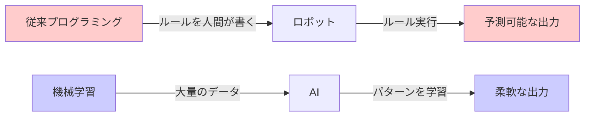
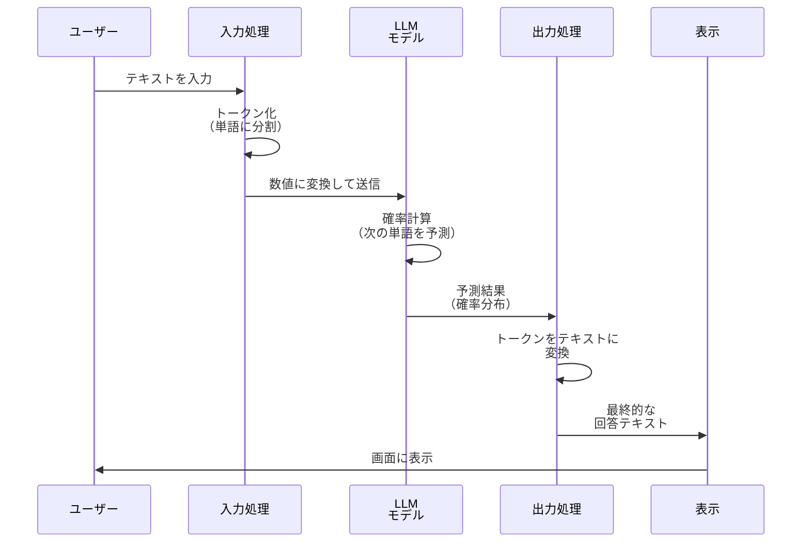
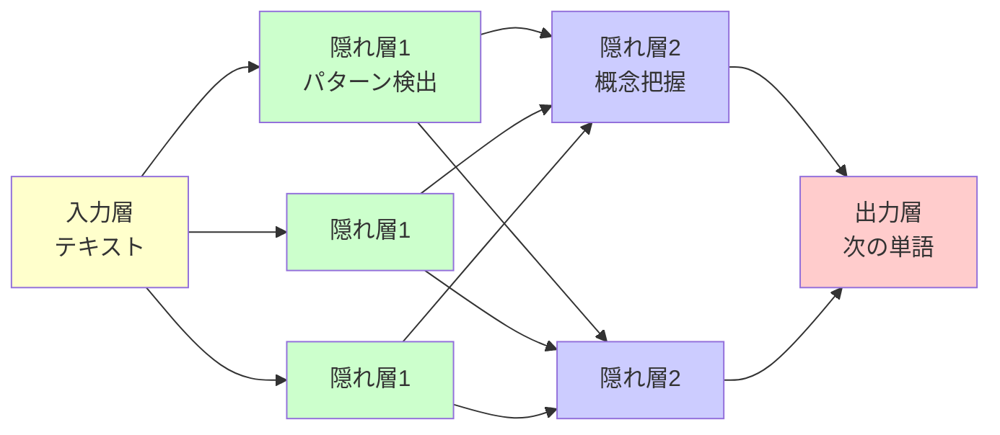
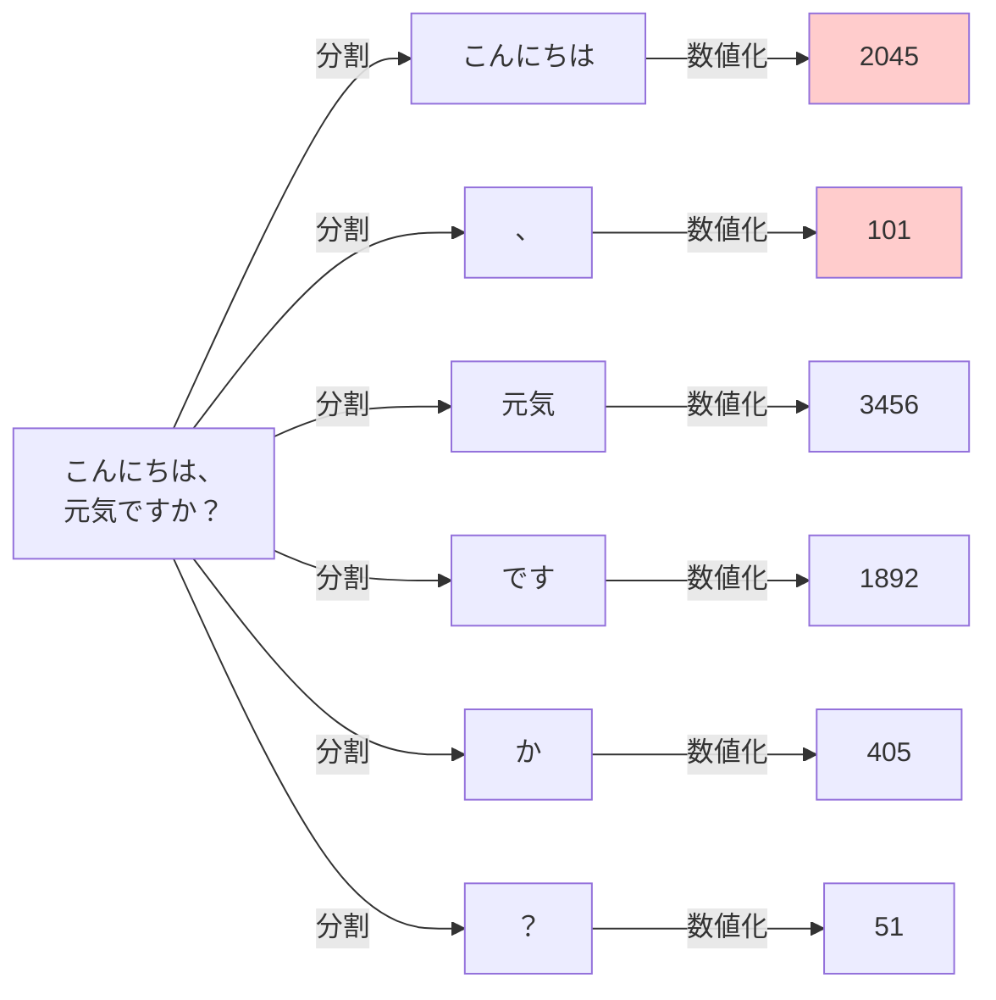
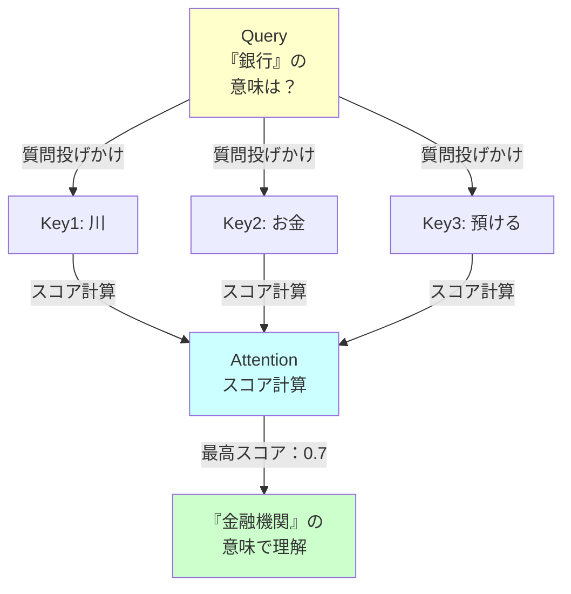

# 🚀 LLM (大規模言語モデル) 初心者向けガイド
**Python開発経験者向け | 知識ゼロからのスタート**

---

## 📚 目次
1. [従来プログラミング vs AI の違い](#従来プログラミング-vs-ai-の違い)
2. [LLM の基本](#llm-の基本)
3. [ニューラルネットワークの仕組み](#ニューラルネットワークの仕組み)
4. [Transformer アーキテクチャ](#transformer-アーキテクチャ)
5. [このプロジェクトで学べること](#このプロジェクトで学べること)

---

## 🎯 従来プログラミング vs AI の違い

### **従来的なプログラミング**

```
入力 → ルール（if/else）→ 出力
       ↑
    人間が明示的に書く
```

**例：計算機プログラム**
```python
def add(a, b):
    return a + b  # ルールが明示的

print(add(5, 3))  # 出力: 8
```

### **AI（機械学習）的アプローチ**

```
入力 → パラメータ（重み） → 出力
       ↑
    データから学習
```

**違い：ルールが隠れている→ データから学習**

```python
# 大量のデータを見て「パターン」を学習
# 実際のルールは人間には見えない
model = LargeLanguageModel()
output = model.predict("質問をしてください")  # 学習したパターンから出力
```

---

## 📊 イメージ図



---

## 💡 LLM の基本

### **LLM とは？**

**LLM = Large Language Model（大規模言語モデル）**

- **Large（大規模）**: 数十億個のパラメータ（重み）を持つ
- **Language（言語）**: テキストを理解・生成
- **Model（モデル）**: 確率的に次の単語を予測

### **簡単な例：次の単語予測**

```
「こんにちは、」→ AI が予測 → 「元気ですか？」
「The quick brown」→ AI が予測 → 「fox」

↑ このパターンを数十億個学習
```

---

## 🔄 LLM の動作フロー



---

## 🧠 ニューラルネットワークの仕組み

### **1. 基本ユニット：ニューロン**

```
入力1 ──┐
入力2 ──┤ × 重み → 足し算 → 活性化関数 → 出力
入力3 ──┘
```

**イメージ：投票のようなもの**
```python
# 簡単な例
def neuron(inputs, weights, bias):
    z = sum(i * w for i, w in zip(inputs, weights)) + bias
    return activation_function(z)  # シグモイド関数など

# 例：入力3個、重み3個
output = neuron([0.5, -0.3, 0.8], [2.0, -1.5, 0.4], 0.1)
```

### **2. ネットワーク構造**



---

## 🚀 Transformer アーキテクチャ

### **LLM の核：Transformer とは**

Transformerはサッカーの試合に例えると：

```
従来のRNN: ボールを順番に回す（時間がかかる）
Transformer: 全選手が同時に相手を見る（並列処理）
```

### **3つの主要な仕組み**

#### **1️⃣ Tokenization（トークン化）**



```python
# Python 例
from transformers import AutoTokenizer

tokenizer = AutoTokenizer.from_pretrained("bert-base-japanese")
text = "こんにちは、元気ですか？"
tokens = tokenizer.encode(text)
print(tokens)  # [2, 2045, 101, 3456, 1892, 405, 51, 3]
```

#### **2️⃣ Attention（注意機構）**

```
Q: 「何に注目すべき？」
K: 「このトークンに注目してください」
V: 「注目したら、この情報を使います」
```

**例：「銀行」という単語の意味を理解する**

```
文1: 「川の銀行で遊んだ」 ← 「川」に注目
文2: 「銀行に お金を預けた」 ← 「お金」に注目
```

各文脈で異なる意味になる→ **Attention が文脈を判断**



#### **3️⃣ Feed-Forward Network（順伝播）**

```
隠れ層での非線形変換
密集 → 活性化 → 密集
4倍拡大    削減
```

```python
# Transformer の基本構成
class TransformerBlock:
    def forward(self, x):
        # Multi-Head Attention
        x = self.attention(x)
        
        # Feed-Forward
        x = self.feed_forward(x)
        
        return x
```

---

## 🎓 LLM の学習方法

### **3つの学習フェーズ**

```mermaid
graph LR
    A["フェーズ1: 事前学習<br/>Pretraining"] -->|何十億個| B["テキストデータ<br/>から学習"]
    B -->|得られるもの| C["一般的な<br/>言語理解"]
    
    C --> D["フェーズ2: ファインチューニング<br/>Fine-tuning"]
    D -->|特定の| E["タスク用データ<br/>で調整"]
    E -->|得られるもの| F["特定の<br/>タスク対応"]
    
    F --> G["フェーズ3: 人間フィードバック<br/>RLHF"]
    G -->|人間の| H["評価データで<br/>最適化"]
    H -->|得られるもの| I["人間らしい<br/>高品質な出力"]
    
    style A fill:#ffcccc
    style C fill:#ffcccc
    style D fill:#ffffcc
    style F fill:#ffffcc
    style G fill:#ccffff
    style I fill:#ccffff
```



---

## 📈 LLM の大きさと能力の関係

```
モデルサイズ         能力
   ↑               ↑
   |      scaling law
   |         /
100B    現在  /
   |       /
  10B    /
   |    /
   | /
   +--------→
```

**重要なポイント：** パラメータ数が多い = より複雑なパターンを学習できる

```
1B（10億） パラメータ → 単純な文法
10B（100億） → 一般的な質問応答
100B（1000億） → 複雑な推理
```

---

## 🔍 このプロジェクトで学べること

本プロジェクトは、これらの概念を **実装レベル** で学べます：

| 技術 | 学ぶ内容 | ファイル |
|------|--------|--------|
| **Tokenization** | テキスト→トークン変換 | `autonomous_rag_agent.py` |
| **Embedding** | トークン→数値ベクトル | `embeddings/` |
| **Fine-tuning** | モデルの特定タスク化 | `fine_tuned_model/` |
| **RAG** | 外部知識の統合 | `autonomous_rag_agent.py` |
| **推論最適化** | 高速な出力生成 | `examples/` |

---

## ✅ 理解度チェック

- [x] 従来プログラミングとAIの違いが説明できる
- [x] LLM が「次の単語予測」の繰り返しだとわかった
- [x] ニューロンと層のイメージが湧いた
- [x] Attention 機構が文脈判断に使われると理解した
- [x] Transformer の3つの部分が説明できる
- [x] 学習フェーズ（事前学習→ファインチューニング→RLHF）の流れが理解できた

---

## 🎯 次のステップ

✅ このガイドを読み終わったら → **[段階2：プロジェクト全体像](02_project_overview_diagram.md)** へ

次のガイドでは、このプロジェクトの **全体アーキテクチャ** を図解します。

---

**質問やフィードバック**: Issue を作成するか、ドキュメント管理者に連絡してください
