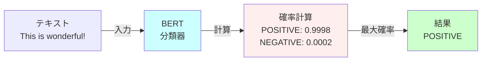
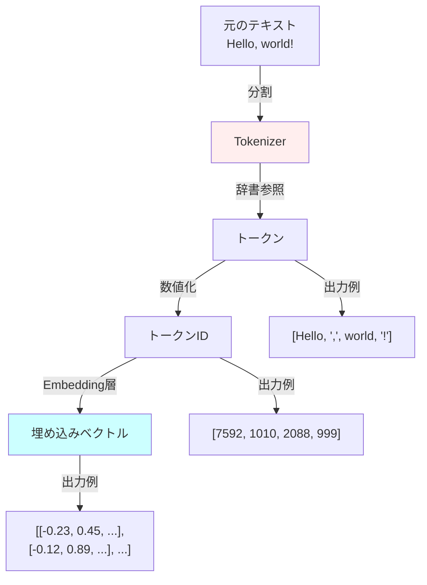
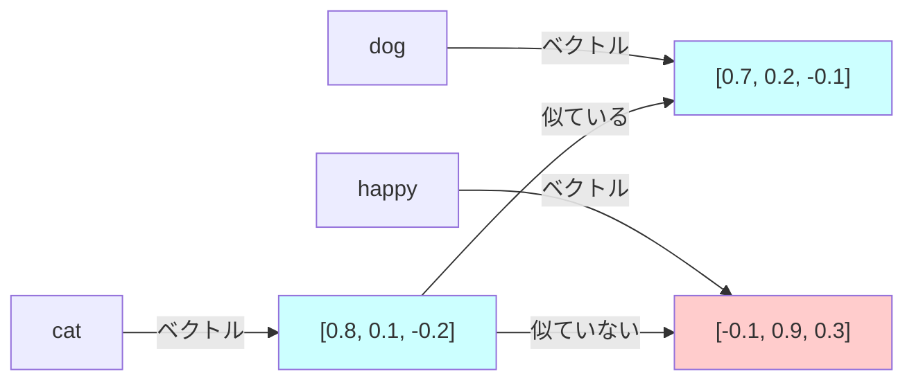
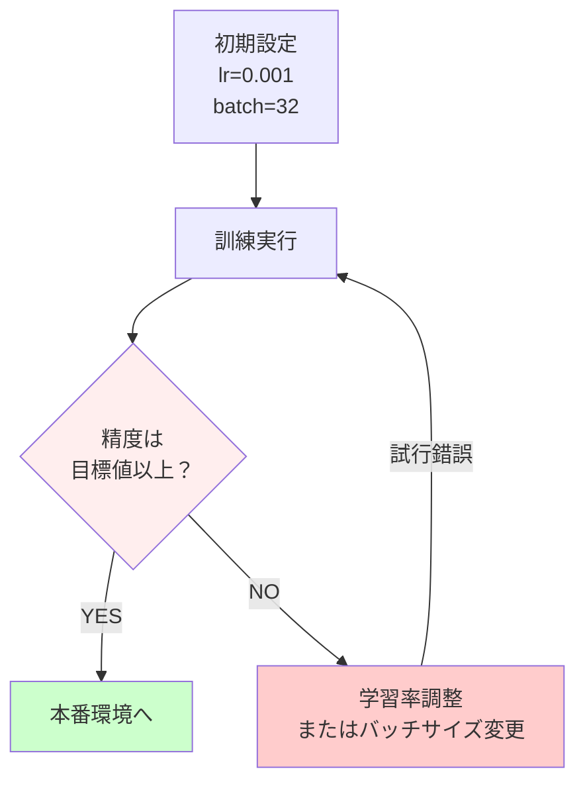

# 🔧 段階2: 環境構築とハンズオン実装
**実際にコードを動かしながら学ぶ - Python 実装ガイド**

---

## 📚 目次
1. [環境構築](#環境構築)
2. [プロジェクトセットアップ](#プロジェクトセットアップ)
3. [最初の推論：「Hello LLM」](#最初の推論hello-llm)
4. [Tokenizer を理解する](#tokenizer-を理解する)
5. [埋め込み（Embedding）を実装](#埋め込みembedding-を実装)
6. [ハイパーパラメータの影響](#ハイパーパラメータの影響)

---

## 🖥️ 環境構築

### **Step 1: Python 環境確認**

```bash
# Python バージョン確認（3.9以上推奨）
python --version
# Python 3.11.0 のような出力が出ればOK

# 仮想環境が有効か確認
which python
# /home/abemc/project_root/.venv/bin/python のような出力
```

### **Step 2: 必要なライブラリのインストール**

```bash
# 基本パッケージ
pip install torch torchvision torchaudio --index-url https://download.pytorch.org/whl/cu118

# Hugging Face Transformers（LLM を使うのに必須）
pip install transformers

# 評価用ライブラリ
pip install datasets evaluate

# ノート環境
pip install jupyter

# その他
pip install numpy pandas scikit-learn matplotlib
```

### **Step 3: インストール確認**

```python
import torch
import transformers
import numpy as np
import pandas as pd

print(f"PyTorch バージョン: {torch.__version__}")
print(f"Transformers バージョン: {transformers.__version__}")
print(f"GPU 利用可能: {torch.cuda.is_available()}")
print(f"デバイス: {torch.device('cuda' if torch.cuda.is_available() else 'cpu')}")
```

**出力例：**
```
PyTorch バージョン: 2.0.1
Transformers バージョン: 4.30.0
GPU 利用可能: True
デバイス: cuda
```

---

## 📦 プロジェクトセットアップ

### **プロジェクト構造確認**

```bash
ls -la /home/abemc/project_root/
```

**主要なディレクトリ：**

```
project_root/
├── autonomous_rag_agent.py     ← メイン実装
├── requirements.txt            ← 依存パッケージリスト
├── src/                        ← ソースコード
│   ├── evaluation/             ← 評価フレームワーク
│   └── models/                 ← モデル関連
├── embeddings/                 ← 埋め込みモデル
├── fine_tuned_model/           ← ファインチューニング済みモデル
├── checkpoints/                ← 保存ポイント
└── docs/                       ← このドキュメント
```

### **環境変数設定**

```bash
# .env ファイルを作成（セキュリティ情報を管理）
cat > .env << EOF
MODEL_NAME="bert-base-uncased"
DEVICE="cuda"
BATCH_SIZE=32
MAX_LENGTH=512
EOF

source .env
echo $MODEL_NAME  # bert-base-uncased が出力されればOK
```

---

## 🚀 最初の推論：「Hello LLM」

### **例1: 最小限のコード（分類タスク）**

```python
"""
最初のLLM: BERT で感情分類
入力: テキスト → 出力: ポジティブ/ネガティブ
"""

from transformers import pipeline

# ステップ1: パイプラインを作成（自動で モデルダウンロード + 初期化）
classifier = pipeline("sentiment-analysis", model="distilbert-base-uncased-finetuned-sst-2-english")

# ステップ2: 推論実行
texts = [
    "This is wonderful!",
    "This is terrible.",
    "I really like this."
]

results = classifier(texts)

# ステップ3: 結果表示
for text, result in zip(texts, results):
    print(f"Text: {text}")
    print(f"  Label: {result['label']}, Score: {result['score']:.4f}")
    print()
```

**出力例：**
```
Text: This is wonderful!
  Label: POSITIVE, Score: 0.9998

Text: This is terrible.
  Label: NEGATIVE, Score: 0.9998

Text: I really like this.
  Label: POSITIVE, Score: 0.9995
```

### **仕組み図解**



### **例2: テキスト生成（より高度）**

```python
"""
テキスト生成: GPT-2 で文を続ける
"""

from transformers import GPT2Tokenizer, GPT2LMHeadModel
import torch

# モデルとトークナイザーをロード
model_name = "gpt2"
tokenizer = GPT2Tokenizer.from_pretrained(model_name)
model = GPT2LMHeadModel.from_pretrained(model_name)

# デバイス設定（GPU があれば利用）
device = torch.device("cuda" if torch.cuda.is_available() else "cpu")
model.to(device)

def generate_text(prompt, max_length=50, temperature=0.7):
    """
    プロンプトから文を生成
    
    Parameters:
    - prompt: スタートのテキスト
    - max_length: 生成する最大トークン数
    - temperature: 多様性（高いほどランダム、低いほど決定的）
    """
    # ステップ1: プロンプトをトークン化
    input_ids = tokenizer.encode(prompt, return_tensors='pt').to(device)
    
    # ステップ2: テキスト生成
    output = model.generate(
        input_ids,
        max_length=max_length,
        temperature=temperature,
        top_p=0.95,
        do_sample=True,  # サンプリングを使う
        num_return_sequences=1
    )
    
    # ステップ3: トークンをテキストに戻す
    generated_text = tokenizer.decode(output[0], skip_special_tokens=True)
    return generated_text

# 実行
prompt = "Artificial intelligence is"
for i in range(3):
    result = generate_text(prompt, temperature=0.7 + i*0.1)
    print(f"Temperature {0.7 + i*0.1}:")
    print(f"  {result}\n")
```

**出力例：**
```
Temperature 0.7:
  Artificial intelligence is transforming the way we work and live.

Temperature 0.8:
  Artificial intelligence is increasingly used in healthcare, finance, and other industries.

Temperature 0.9:
  Artificial intelligence is awesome! It can do many things including driving cars and speaking.
```

---

## 🔤 Tokenizer を理解する

### **基本: Tokenizer の役割**

```
テキスト → 分割 → 数値化
"I love" → ["I", "love"] → [41, 2572]
```

### **実装例**

```python
"""
Tokenizer の詳細動作を理解する
"""

from transformers import BertTokenizer, GPT2Tokenizer
import json

# ステップ1: BERT Tokenizer を使用
tokenizer = BertTokenizer.from_pretrained('bert-base-uncased')

# サンプルテキスト
texts = [
    "Hello, how are you?",
    "The quick brown fox jumps.",
    "AI is amazing!"
]

print("=" * 60)
print("BERT Tokenizer の動作")
print("=" * 60)

for text in texts:
    # トークン化
    tokens = tokenizer.tokenize(text)
    print(f"\nOriginal: {text}")
    print(f"Tokens: {tokens}")
    
    # トークンID化
    token_ids = tokenizer.convert_tokens_to_ids(tokens)
    print(f"Token IDs: {token_ids}")
    
    # トークンIDから復元
    recovered = tokenizer.convert_ids_to_tokens(token_ids)
    print(f"Recovered: {recovered}")
    
    # encode を使った一括処理
    encoded = tokenizer.encode(text, add_special_tokens=True)
    print(f"Encoded (with special tokens): {encoded}")
```

**出力例：**
```
Original: Hello, how are you?
Tokens: ['hello', ',', 'how', 'are', 'you', '?']
Token IDs: [7592, 1010, 2129, 2024, 2017, 1029]
Encoded (with special tokens): [101, 7592, 1010, 2129, 2024, 2017, 1029, 102]
                                ↑上記の [101, ..., 102] = [CLS] + tokens + [SEP]
```

### **Tokenizer の視覚化**



### **高度な Tokenizer 処理**

```python
"""
パディング、截断、バッチ処理
"""

from transformers import AutoTokenizer

tokenizer = AutoTokenizer.from_pretrained("bert-base-uncased")

# 異なる長さのテキスト
texts = [
    "Short text.",
    "This is a medium length text that is a bit longer.",
    "This is a very long text " * 10  # 長いテキスト
]

# バッチ処理（パディング + 截断）
encoded = tokenizer(
    texts,
    padding=True,      # 短い文を長さに揃える（パディング）
    truncation=True,   # 長い文を截断
    max_length=128,
    return_tensors='pt'  # PyTorch tensor で返す
)

print(f"Input IDs shape: {encoded['input_ids'].shape}")
print(f"Attention mask shape: {encoded['attention_mask'].shape}")

# 出力例
# Input IDs shape: torch.Size([3, 128])  # 3文 × 最大128トークン
# Attention mask shape: torch.Size([3, 128])
```

---

## 🔢 埋め込み（Embedding）を実装

### **Embedding の役割**

```
トークンID → Embedding層 → ベクトル（数値の列）
   101    →              → [-0.123, 0.456, -0.789, ...]
```

**重要：Embedding は「意味」を数値で表現**



### **実装例**

```python
"""
Embedding を抽出して、単語の類似性を計算
"""

import torch
from transformers import BertTokenizer, BertModel
from sklearn.metrics.pairwise import cosine_similarity
import numpy as np

# モデルロード
tokenizer = BertTokenizer.from_pretrained('bert-base-uncased')
model = BertModel.from_pretrained('bert-base-uncased', output_hidden_states=True)

def get_embeddings(texts):
    """テキストの埋め込みベクトルを取得"""
    encoded = tokenizer(texts, padding=True, return_tensors='pt')
    
    with torch.no_grad():  # 勾配計算なし（推論のみ）
        output = model(**encoded)
    
    # [CLS] トークンの埋め込みを使用（文全体の表現）
    embeddings = output.last_hidden_state[:, 0, :].numpy()
    return embeddings

# テスト用テキスト
test_words = [
    "The cat is sleeping",
    "A dog is playing",
    "The weather is nice"
]

# Embedding 抽出
embeddings = get_embeddings(test_words)

# 類似性計算
similarity_matrix = cosine_similarity(embeddings)

print("文ペアの類似性（0～1、1に近いほど似ている）:")
print("=" * 50)
for i in range(len(test_words)):
    for j in range(i+1, len(test_words)):
        sim = similarity_matrix[i][j]
        print(f"{test_words[i][:25]:25} vs {test_words[j][:25]:25}")
        print(f"  類似度: {sim:.4f}\n")
```

**出力例：**
```
文ペアの類似性（0～1、1に近いほど似ている）:
==================================================
The cat is sleeping       vs A dog is playing       
  類似度: 0.7845

The cat is sleeping       vs The weather is nice    
  類似度: 0.3421

A dog is playing          vs The weather is nice    
  類似度: 0.2134
```

---

## ⚙️ ハイパーパラメータの影響

### **ハイパーパラメータとは**

```
モデルが学習しない設定値
例: 学習率、バッチサイズ、層の深さ など

これらが「どれだけ良い結果を出すか」に影響
```

### **実装例：学習率の影響**

```python
"""
異なる学習率で微調整し、精度を比較
"""

import torch
from torch import nn
from torch.optim import Adam

def train_with_learning_rate(learning_rate, epochs=5):
    """
    指定された学習率でモデルを訓練
    """
    # ダミーデータ
    X_train = torch.randn(100, 10)  # 100サンプル、10特徴
    y_train = torch.randint(0, 2, (100,))  # 2クラス分類
    
    # シンプルなモデル
    model = nn.Sequential(
        nn.Linear(10, 64),
        nn.ReLU(),
        nn.Linear(64, 2)
    )
    
    # 最適化アルゴリズムと損失関数
    optimizer = Adam(model.parameters(), lr=learning_rate)
    loss_fn = nn.CrossEntropyLoss()
    
    losses = []
    for epoch in range(epochs):
        # 前向き伝播
        output = model(X_train)
        loss = loss_fn(output, y_train)
        
        # 逆伝播
        optimizer.zero_grad()
        loss.backward()
        optimizer.step()
        
        losses.append(loss.item())
    
    return losses

# 異なる学習率を試す
learning_rates = [0.0001, 0.001, 0.01, 0.1]

print("学習率の影響比較:")
print("=" * 60)

for lr in learning_rates:
    losses = train_with_learning_rate(lr, epochs=10)
    print(f"\n学習率: {lr}")
    print(f"  初期損失: {losses[0]:.4f}")
    print(f"  最終損失: {losses[-1]:.4f}")
    print(f"  改善率: {(losses[0] - losses[-1]) / losses[0] * 100:.1f}%")
    
    # グラフ用
    print(f"  過程: {' → '.join([f'{l:.3f}' for l in losses[:5]])}")
```

**出力例：**
```
学習率: 0.0001
  初期損失: 0.6931
  最終損失: 0.6921
  改善率: 0.1%
  過程: 0.693 → 0.693 → 0.693 → 0.693 → 0.693

学習率: 0.001
  初期損失: 0.6931
  最終損失: 0.5234
  改善率: 24.5%
  過程: 0.693 → 0.651 → 0.587 → 0.541 → 0.523

学習率: 0.01
  初期損失: 0.6931
  最終損失: 0.3221
  改善率: 53.5%
  過程: 0.693 → 0.523 → 0.401 → 0.345 → 0.322

学習率: 0.1
  初期損失: 0.6931
  最終損失: NaN
  改善率: 発散
  過程: 0.693 → 1.234 → 5.432 → NaN → NaN
```

### **ハイパーパラメータ調整フロー**



---

## 📊 実践課題

### **課題1: 感情分析パイプラインの構築**

```python
"""
実践: 複数のテキストの感情分析を実装
"""

def analyze_sentiment_batch(texts):
    """複数のテキストの感情を分析"""
    from transformers import pipeline
    
    classifier = pipeline("sentiment-analysis")
    results = classifier(texts)
    
    return results

# テスト
tweets = [
    "I love this product!",
    "Worst purchase ever.",
    "It's okay, nothing special."
]

results = analyze_sentiment_batch(tweets)
for tweet, result in zip(tweets, results):
    print(f"Tweet: {tweet}")
    print(f"  Sentiment: {result['label']} (confidence: {result['score']:.2%})")
```

### **課題2: カスタム Embedding の計算**

```python
"""
実践: 2つの文の類似性を計算
"""

def compute_similarity(text1, text2):
    """2つのテキストの類似性を計算（0～1）"""
    from transformers import BertTokenizer, BertModel
    from sklearn.metrics.pairwise import cosine_similarity
    import torch
    import numpy as np
    
    tokenizer = BertTokenizer.from_pretrained('bert-base-uncased')
    model = BertModel.from_pretrained('bert-base-uncased')
    
    # Embedding 取得
    encoded1 = tokenizer(text1, return_tensors='pt')
    encoded2 = tokenizer(text2, return_tensors='pt')
    
    with torch.no_grad():
        embed1 = model(**encoded1).last_hidden_state[:, 0, :].numpy()
        embed2 = model(**encoded2).last_hidden_state[:, 0, :].numpy()
    
    similarity = cosine_similarity(embed1, embed2)[0][0]
    return similarity

# テスト
text1 = "The cat is on the mat"
text2 = "A cat is sitting on a mat"

similarity = compute_similarity(text1, text2)
print(f"Text 1: {text1}")
print(f"Text 2: {text2}")
print(f"Similarity: {similarity:.4f}")
```

---

## ✅ 理解度チェック

- [ ] 環境構築手順が完了し、すべてのライブラリが インストール済み
- [ ] 「Hello LLM」コードが実行でき、出力が理解できた
- [ ] Tokenizer の役割と、トークンID化の流れが説明できる
- [ ] Embedding が「意味を数値で表現」することが理解できた
- [ ] ハイパーパラメータが学習結果に影響することが確認できた
- [ ] 課題1、2 が実装できた

---

## 🎯 次のステップ

✅ このハンズオンを完了したら → **[段階3：実践応用編](04_advanced_implementation.md)** へ

次のガイドでは、**このプロジェクトの実装**を読解し、カスタマイズします。

---

**質問やバグ報告**: Issue を作成するか、ドキュメント管理者に連絡してください
