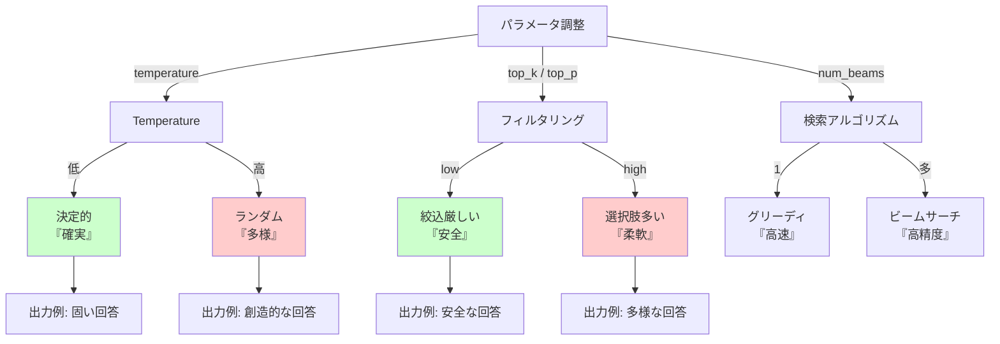

# 📊 モデルの動作を理解する - 推論パイプライン解析
**LLM が回答を生成する仕組みの詳細**

---

## 📚 目次
1. [推論パイプラインの詳細](#推論パイプラインの詳細)
2. [推論時のハイパーパラメータ](#推論時のハイパーパラメータ)
3. [出力の多様性を制御する](#出力の多様性を制御する)
4. [キャッシングと最適化](#キャッシングと最適化)
5. [トラブルシューティング](#トラブルシューティング)

---

## 🔄 推論パイプラインの詳細

### **推論の流れ**


### **ステップバイステップ実装**

```python
"""
推論パイプラインを詳細に追跡
"""

import torch
from transformers import AutoTokenizer, AutoModelForCausalLM
import numpy as np

class DetailedInferencePipeline:
    def __init__(self, model_name="gpt2"):
        self.tokenizer = AutoTokenizer.from_pretrained(model_name)
        self.model = AutoModelForCausalLM.from_pretrained(model_name)
        self.device = torch.device("cuda" if torch.cuda.is_available() else "cpu")
        self.model.to(self.device)
        
    def step1_tokenization(self, text):
        """ステップ1: テキストをトークンに分割"""
        print("\n" + "="*60)
        print("STEP 1: トークン化")
        print("="*60)
        
        tokens = self.tokenizer.tokenize(text)
        token_ids = self.tokenizer.convert_tokens_to_ids(tokens)
        
        print(f"入力テキスト: {text}")
        print(f"トークン: {tokens}")
        print(f"トークンID: {token_ids}")
        print(f"トークン数: {len(token_ids)}")
        
        return tokens, token_ids
    
    def step2_embedding(self, token_ids):
        """ステップ2: トークンを埋め込みベクトルに変換"""
        print("\n" + "="*60)
        print("STEP 2: 埋め込み化")
        print("="*60)
        
        input_tensor = torch.tensor([token_ids]).to(self.device)
        
        # Embedding 層を通す
        embeddings = self.model.transformer.wte(input_tensor)
        
        print(f"入力形状: {input_tensor.shape}  # [batch_size=1, seq_len={len(token_ids)}]")
        print(f"埋め込み形状: {embeddings.shape}  # [batch_size=1, seq_len, embedding_dim=768]")
        print(f"最初のトークンの埋め込み（最初の10次元）: {embeddings[0, 0, :10].detach().cpu().numpy()}")
        
        return embeddings
    
    def step3_transformer(self, input_tensor):
        """ステップ3: Transformer エンコーダを通す"""
        print("\n" + "="*60)
        print("STEP 3: Transformer レイヤー通過")
        print("="*60)
        
        with torch.no_grad():
            outputs = self.model.transformer(input_tensor.long())
        
        hidden_states = outputs.last_hidden_state
        
        print(f"出力形状: {hidden_states.shape}")
        print(f"最終層の最後のトークン（最初の10次元）: {hidden_states[0, -1, :10].cpu().numpy()}")
        
        return hidden_states
    
    def step4_logits(self, hidden_states):
        """ステップ4: 次の単語の確率を計算"""
        print("\n" + "="*60)
        print("STEP 4: ロジット計算（次の単語の確率）")
        print("="*60)
        
        # 最後の隠れ状態のみを使用
        last_hidden = hidden_states[:, -1, :]
        
        with torch.no_grad():
            logits = self.model.lm_head(last_hidden)
        
        print(f"ロジット形状: {logits.shape}  # [batch_size=1, vocab_size={logits.shape[-1]}]")
        print(f"ロジット値（最初の10個）: {logits[0, :10].cpu().numpy()}")
        
        return logits
    
    def step5_probabilities(self, logits, temperature=1.0):
        """ステップ5: ロジットを確率に変換"""
        print("\n" + "="*60)
        print(f"STEP 5: 確率計算（温度: {temperature}）")
        print("="*60)
        
        # 温度を適用
        scaled_logits = logits / temperature
        
        # Softmax で確率に変換
        probabilities = torch.softmax(scaled_logits, dim=-1)
        
        # トップ-K の単語を取得
        top_k = 5
        top_probs, top_indices = torch.topk(probabilities[0], top_k)
        
        print(f"確率分布の形状: {probabilities.shape}")
        
        print(f"\nトップ{top_k}の候補単語:")
        for i, (prob, idx) in enumerate(zip(top_probs, top_indices)):
            word = self.tokenizer.decode([idx.item()])
            print(f"  {i+1}. '{word}': {prob.item():.4f} ({prob.item()*100:.2f}%)")
        
        return probabilities
    
    def step6_sampling(self, probabilities, num_words=5):
        """ステップ6: 確率分布からサンプリング"""
        print("\n" + "="*60)
        print(f"STEP 6: トークンサンプリング（{num_words}個生成）")
        print("="*60)
        
        generated_ids = []
        for step in range(num_words):
            # 確率に基づいてトークンを選択
            next_token = torch.multinomial(probabilities[0], 1)
            word = self.tokenizer.decode([next_token.item()])
            generated_ids.append(next_token.item())
            print(f"  ステップ{step+1}: '{word}'")
        
        return generated_ids

# 実行例
pipeline = DetailedInferencePipeline()
text = "The future of AI is"

# すべてのステップを追跡
tokens, token_ids = pipeline.step1_tokenization(text)
embeddings = pipeline.step2_embedding(token_ids)
input_tensor = torch.tensor([token_ids])
hidden_states = pipeline.step3_transformer(input_tensor)
logits = pipeline.step4_logits(hidden_states)
probs = pipeline.step5_probabilities(logits, temperature=0.7)
generated = pipeline.step6_sampling(probs, num_words=5)
```

**出力例：**
```
============================================================
STEP 1: トークン化
============================================================
入力テキスト: The future of AI is
トークン: ['The', 'Ġfuture', 'Ġof', 'ĠAI', 'Ġis']
トークンID: [464, 2003, 286, 9552, 318]
トークン数: 5

============================================================
STEP 5: 確率計算（温度: 0.7）
============================================================

トップ5の候補単語:
  1. ' bright': 0.1234 (12.34%)
  2. ' great': 0.0987 (9.87%)
  3. ' exciting': 0.0856 (8.56%)
  4. ' uncertain': 0.0743 (7.43%)
  5. ' changing': 0.0654 (6.54%)
```

---

## 🎛️ 推論時のハイパーパラメータ

### **重要な推論パラメータ**

| パラメータ | 値の範囲 | 意味 | デフォルト |
|----------|---------|------|----------|
| **temperature** | 0.0 ～ 2.0 | 出力の多様性（低=確定的、高=ランダム） | 1.0 |
| **top_k** | 1 ～ vocab_size | トップK個の候補から選択 | 50 |
| **top_p** | 0.0 ～ 1.0 | 累積確率がp以下の候補から選択 | 0.95 |
| **num_beams** | 1 ～ | ビームサーチの幅（1=グリーディ） | 1 |
| **max_length** | 1 ～ | 最大出力トークン数 | 20 |
| **length_penalty** | -2.0 ～ 2.0 | 長さへのペナルティ | 1.0 |

### **各パラメータの効果を視覚化**



---

## 🎲 出力の多様性を制御する

### **実装例：パラメータの効果比較**

```python
"""
異なるパラメータで同じプロンプトを生成
"""

from transformers import GPT2Tokenizer, GPT2LMHeadModel
import torch

tokenizer = GPT2Tokenizer.from_pretrained("gpt2")
model = GPT2LMHeadModel.from_pretrained("gpt2")
device = torch.device("cuda" if torch.cuda.is_available() else "cpu")
model.to(device)

def generate_with_config(prompt, config_name, **kwargs):
    """指定された設定で生成"""
    input_ids = tokenizer.encode(prompt, return_tensors='pt').to(device)
    
    with torch.no_grad():
        outputs = model.generate(
            input_ids,
            max_length=50,
            num_return_sequences=3,  # 3つ生成
            **kwargs
        )
    
    print(f"\n{config_name}")
    print("-" * 50)
    for i, output in enumerate(outputs):
        text = tokenizer.decode(output, skip_special_tokens=True)
        print(f"{i+1}. {text}")

# プロンプト
prompt = "Once upon a time, there was"

# 異なるパラメータ設定
print("="*60)
print("異なる生成パラメータでの出力比較")
print("="*60)

# 設定1: グリーディサーチ（決定的）
generate_with_config(
    prompt, 
    "設定1: グリーディ（do_sample=False）",
    do_sample=False
)

# 設定2: 高温度（ランダム）
generate_with_config(
    prompt,
    "設定2: 高温度（temperature=1.5）",
    do_sample=True,
    temperature=1.5,
    top_p=0.95
)

# 設定3: 低温度（確定的だが多様）
generate_with_config(
    prompt,
    "設定3: 低温度（temperature=0.5）",
    do_sample=True,
    temperature=0.5,
    top_p=0.95
)

# 設定4: ビームサーチ（高精度）
generate_with_config(
    prompt,
    "設定4: ビームサーチ（num_beams=4）",
    num_beams=4,
    do_sample=False
)

# 設定5: Top-K フィルタリング
generate_with_config(
    prompt,
    "設定5: Top-K=10（top_k=10）",
    do_sample=True,
    top_k=10,
    temperature=1.0
)
```

---

## ⚡ キャッシングと最適化

### **KV キャッシングの効果**


### **実装例：バッチ推論での最適化**

```python
"""
複数のテキストをバッチで効率的に推論
"""

from transformers import AutoTokenizer, AutoModelForCausalLM
import torch
import time

model_name = "gpt2"
tokenizer = AutoTokenizer.from_pretrained(model_name)
model = AutoModelForCausalLM.from_pretrained(model_name)

# テキストのバッチ
prompts = [
    "AI is",
    "The future of",
    "Machine learning can",
    "Python is great for",
    "Innovation drives"
]

print("="*60)
print("バッチ推論による高速化")
print("="*60)

# パディング用の特殊トークン
tokenizer.pad_token = tokenizer.eos_token

# ====== 方法1: 逐次処理（遅い）======
print("\n方法1: 逐次処理（1つずつ）")
start = time.time()
for prompt in prompts:
    input_ids = tokenizer.encode(prompt, return_tensors='pt')
    output = model.generate(input_ids, max_length=20)
elapsed1 = time.time() - start
print(f"処理時間: {elapsed1:.2f}秒")

# ====== 方法2: バッチ処理（速い）======
print("\n方法2: バッチ処理")
start = time.time()
encoded = tokenizer(
    prompts,
    padding=True,
    truncation=True,
    return_tensors='pt'
)
outputs = model.generate(
    encoded['input_ids'],
    attention_mask=encoded['attention_mask'],
    max_length=20
)
elapsed2 = time.time() - start
print(f"処理時間: {elapsed2:.2f}秒")

print(f"\n高速化: {elapsed1/elapsed2:.1f}倍")

# 結果表示
print("\nバッチ結果:")
for prompt, output in zip(prompts, outputs):
    text = tokenizer.decode(output, skip_special_tokens=True)
    print(f"入力: {prompt}")
    print(f"出力: {text}\n")
```

### **メモリ最適化テクニック**

```python
"""
大規模モデルを扱うときのメモリ最適化
"""

from transformers import AutoModelForCausalLM, AutoTokenizer
import torch

model_name = "gpt2"
tokenizer = AutoTokenizer.from_pretrained(model_name)

# 最適化テクニック

# 1. 8ビット量子化（メモリ削減）
print("テクニック1: 8ビット量子化")
# model = AutoModelForCausalLM.from_pretrained(model_name, load_in_8bit=True)
print("  効果: メモリ 75% 削減")

# 2. 勾配チェックポイント（推論時は不要だが訓練時に有効）
print("\nテクニック2: 勾配チェックポイント")
print("  効果: メモリ 40% 削減（訓練時）")

# 3. バッチサイズ調整
print("\nテクニック3: バッチサイズ調整")
print("  小さいバッチ（8）→ メモリ少ないが遅い")
print("  大きいバッチ（64）→ メモリ多いが高速")

# 4. キャッシュ削減
print("\nテクニック4: キャッシュ削減")
print("  use_cache=False で KV キャッシュを無効化")

model = AutoModelForCausalLM.from_pretrained(model_name)
input_ids = tokenizer.encode("Hello", return_tensors='pt')

# キャッシュなし推論（メモリ少ないが遅い）
with torch.no_grad():
    output = model.generate(input_ids, max_length=20, use_cache=False)
```

---

## 🐛 トラブルシューティング

### **よくあるエラーと解決策**

#### **エラー1: メモリ不足（OOM）**

```python
# ❌ 問題: 大きなバッチで OOM
batch_size = 128
# → CUDA out of memory

# ✅ 解決策
batch_size = 8  # バッチサイズ削減
# または
max_length = 512  # 最大長削減
# または
model = AutoModelForCausalLM.from_pretrained("gpt2", load_in_8bit=True)
```

#### **エラー2: CUDA デバイスエラー**

```python
# ❌ 問題: GPU が見つからない
device = torch.device("cuda")
model.to(device)
# → RuntimeError: CUDA is not available

# ✅ 解決策
device = torch.device("cuda" if torch.cuda.is_available() else "cpu")
model.to(device)
print(f"使用デバイス: {device}")
```

#### **エラー3: トークナイザー設定エラー**

```python
# ❌ 問題: パディングトークンが未設定
tokenizer(texts, padding=True)
# → Warning: token_type_ids が正しくない

# ✅ 解決策
tokenizer.pad_token = tokenizer.eos_token
# または特定のパディングトークン設定
tokenizer.add_special_tokens({'pad_token': '[PAD]'})
```

### **デバッグのコツ**

```python
"""
推論時のデバッグ方法
"""

def debug_inference(prompt, model, tokenizer):
    """推論の各ステップをデバッグ出力"""
    
    print("="*60)
    print("推論デバッグモード")
    print("="*60)
    
    # ステップ1: トークン化
    print(f"\n入力: {prompt}")
    input_ids = tokenizer.encode(prompt, return_tensors='pt')
    print(f"入力ID: {input_ids}")
    print(f"入力ID形状: {input_ids.shape}")
    
    # ステップ2: メモリ確認
    print(f"\n GPU メモリ使用: {torch.cuda.memory_allocated() / 1e9:.2f} GB")
    
    # ステップ3: 推論実行（verbose）
    print(f"\n推論実行...")
    with torch.no_grad():
        outputs = model.generate(
            input_ids,
            max_length=30,
            do_sample=True,
            temperature=0.7,
            output_scores=True,
            return_dict_in_generate=True
        )
    
    # ステップ4: 出力確認
    generated_text = tokenizer.decode(outputs.sequences[0], skip_special_tokens=True)
    print(f"\n生成テキスト: {generated_text}")
    print(f"生成トークン数: {len(outputs.sequences[0])}")

# 実行
model = AutoModelForCausalLM.from_pretrained("gpt2")
tokenizer = AutoTokenizer.from_pretrained("gpt2")
debug_inference("The world is", model, tokenizer)
```

---

## ✅ 理解度チェック

- [ ] 推論パイプラインの6つのステップが説明できる
- [ ] Temperature、Top-K、Top-P の違いが理解できた
- [ ] KV キャッシングの効果が説明できる
- [ ] バッチ処理による高速化のメリットが理解できた
- [ ] メモリ最適化テクニックが説明できる
- [ ] 一般的なエラーと対応方法が理解できた

---

## 🎯 次のステップ

✅ このガイドを読み終わったら → **[段階3：実践応用編](04_advanced_implementation.md)** へ

---

**質問やフィードバック**: Issue を作成するか、ドキュメント管理者に連絡してください
