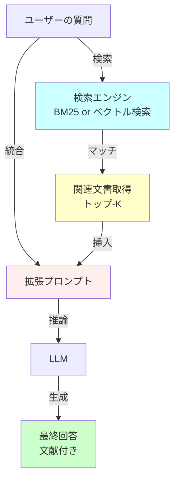
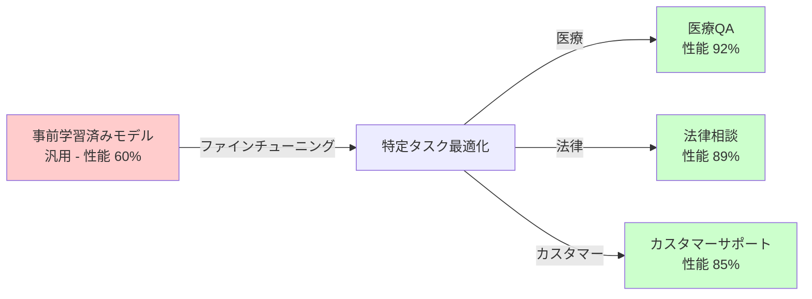
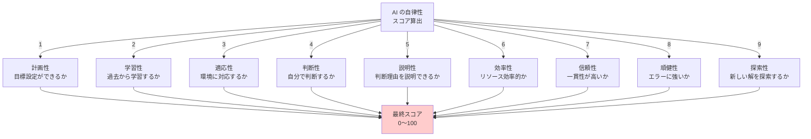
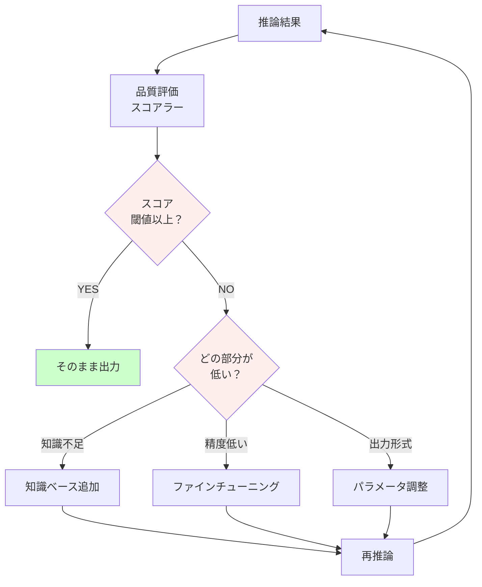

# 🚀 段階3: 実践応用 - プロジェクト実装詳細
**このプロジェクトの主要機能を理解・カスタマイズする**

---

## 📚 目次
1. [RAG（検索拡張生成）の実装](#ragの実装)
2. [ファインチューニング](#ファインチューニング)
3. [自律性スコアラー](#自律性スコアラー)
4. [フィードバックループ](#フィードバックループ)
5. [このプロジェクトの拡張](#このプロジェクトの拡張)

---

## 📚 RAG（検索拡張生成）の実装

### **RAG の全体フロー**



### **実装例：簡易 RAG システム**

```python
"""
プロジェクトの autonomous_rag_agent.py から抽出した概念
簡易版 RAG 実装
"""

from transformers import AutoTokenizer, AutoModelForCausalLM
from sklearn.feature_extraction.text import TfidfVectorizer
from sklearn.metrics.pairwise import cosine_similarity
import numpy as np

class SimpleRAG:
    def __init__(self, model_name="gpt2"):
        """RAG システムの初期化"""
        self.tokenizer = AutoTokenizer.from_pretrained(model_name)
        self.model = AutoModelForCausalLM.from_pretrained(model_name)
        self.tokenizer.pad_token = self.tokenizer.eos_token
        
        # 知識ベース（簡易版）
        self.knowledge_base = [
            "Python is a high-level programming language.",
            "Machine learning is a subset of artificial intelligence.",
            "Deep learning uses neural networks with multiple layers.",
            "Natural language processing deals with text analysis.",
            "Transformers are neural network architectures based on attention.",
        ]
        
        # TF-IDF ベクトル化
        self.vectorizer = TfidfVectorizer()
        self.knowledge_vectors = self.vectorizer.fit_transform(self.knowledge_base)
    
    def retrieve_documents(self, query, top_k=2):
        """
        質問に関連する文書を検索
        
        Parameters:
        - query: ユーザーの質問
        - top_k: 取得する関連文書の数
        
        Returns:
        - 関連文書のリスト
        """
        # クエリをベクトル化
        query_vector = self.vectorizer.transform([query])
        
        # コサイン類似度計算
        similarities = cosine_similarity(query_vector, self.knowledge_vectors)[0]
        
        # トップ-K を取得
        top_indices = np.argsort(similarities)[::-1][:top_k]
        
        retrieved_docs = [self.knowledge_base[i] for i in top_indices]
        retrieved_scores = [similarities[i] for i in top_indices]
        
        return retrieved_docs, retrieved_scores
    
    def generate_answer(self, query, retrieved_docs):
        """
        検索結果を使ってテキストを生成
        
        Parameters:
        - query: 元の質問
        - retrieved_docs: 検索で取得した関連文書
        
        Returns:
        - 生成された回答テキスト
        """
        # プロンプト作成（検索結果を挿入）
        prompt = f"""Based on the following information:

{chr(10).join([f'- {doc}' for doc in retrieved_docs])}

Answer the question: {query}

Answer:"""
        
        # トークン化
        input_ids = self.tokenizer.encode(prompt, return_tensors='pt')
        
        # テキスト生成
        with torch.no_grad():
            outputs = self.model.generate(
                input_ids,
                max_length=100,
                temperature=0.7,
                top_p=0.95,
                do_sample=True
            )
        
        answer = self.tokenizer.decode(outputs[0], skip_special_tokens=True)
        return answer
    
    def process(self, query):
        """
        RAG の完全なフロー実行
        
        Parameters:
        - query: ユーザーの質問
        
        Returns:
        - 生成された回答
        """
        print(f"\n質問: {query}")
        print("-" * 60)
        
        # ステップ1: 関連文書を検索
        docs, scores = self.retrieve_documents(query, top_k=2)
        print(f"\n検索結果（トップ-2）:")
        for i, (doc, score) in enumerate(zip(docs, scores)):
            print(f"  {i+1}. スコア: {score:.4f}")
            print(f"     内容: {doc}")
        
        # ステップ2: 回答を生成
        answer = self.generate_answer(query, docs)
        print(f"\n生成された回答:")
        print(f"  {answer}")
        
        return answer

# 使用例
import torch

rag = SimpleRAG()

# テスト
queries = [
    "What is machine learning?",
    "Tell me about transformers",
    "How does NLP work?"
]

for query in queries:
    rag.process(query)
```

### **より高度な RAG：ベクトル検索**

```python
"""
ベクトル埋め込みを使った RAG（より精度が高い）
"""

from transformers import AutoTokenizer, AutoModel
import torch
import numpy as np

class VectorRAG:
    def __init__(self, model_name="sentence-transformers/all-MiniLM-L6-v2"):
        """ベクトル埋め込み使用 RAG の初期化"""
        from sentence_transformers import SentenceTransformer
        
        self.model = SentenceTransformer(model_name)
        
        # 知識ベース
        self.knowledge_base = [
            "Python is a high-level programming language.",
            "Machine learning is a subset of artificial intelligence.",
            "Deep learning uses neural networks with multiple layers.",
            "Natural language processing deals with text analysis.",
            "Transformers are neural network architectures based on attention.",
        ]
        
        # 知識ベースを埋め込み化（事前に計算）
        self.knowledge_embeddings = self.model.encode(
            self.knowledge_base,
            convert_to_tensor=True
        )
    
    def retrieve_documents(self, query, top_k=2):
        """ベクトル類似度で関連文書を検索（より精度が高い）"""
        # クエリを埋め込み化
        query_embedding = self.model.encode(query, convert_to_tensor=True)
        
        # コサイン類似度計算
        similarities = torch.nn.functional.cosine_similarity(
            query_embedding.unsqueeze(0),
            self.knowledge_embeddings
        )
        
        # トップ-K を取得
        top_indices = torch.argsort(similarities, descending=True)[:top_k]
        
        retrieved_docs = [self.knowledge_base[i] for i in top_indices]
        retrieved_scores = [similarities[i].item() for i in top_indices]
        
        return retrieved_docs, retrieved_scores
    
    def process(self, query):
        """ベクトル RAG の実行"""
        docs, scores = self.retrieve_documents(query, top_k=2)
        
        print(f"質問: {query}")
        print(f"検索結果:")
        for doc, score in zip(docs, scores):
            print(f"  スコア: {score:.4f} - {doc}")
        
        return docs

# 使用例
# vector_rag = VectorRAG()
# vector_rag.process("What is deep learning?")
```

---

## 🎯 ファインチューニング

### **なぜファインチューニングが必要か**



### **ファインチューニングの実装**

```python
"""
Hugging Face Transformers を使ったファインチューニング
"""

from transformers import AutoTokenizer, AutoModelForSequenceClassification, Trainer, TrainingArguments
from datasets import Dataset
import torch

class FineTuner:
    def __init__(self, model_name="distilbert-base-uncased"):
        """ファインチューニャーの初期化"""
        self.model_name = model_name
        self.tokenizer = AutoTokenizer.from_pretrained(model_name)
        self.model = AutoModelForSequenceClassification.from_pretrained(
            model_name, num_labels=2  # 2値分類の例
        )
    
    def prepare_data(self, texts, labels):
        """
        テキストとラベルを準備
        
        Parameters:
        - texts: テキストのリスト
        - labels: ラベルのリスト（0 または 1）
        
        Returns:
        - Dataset オブジェクト
        """
        # トークン化
        encodings = self.tokenizer(
            texts,
            truncation=True,
            padding=True,
            max_length=512
        )
        
        # Dataset 作成
        dataset = Dataset.from_dict({
            'input_ids': encodings['input_ids'],
            'attention_mask': encodings['attention_mask'],
            'labels': labels
        })
        
        return dataset
    
    def fine_tune(self, train_dataset, output_dir="./fine_tuned_model"):
        """
        ファインチューニング実行
        
        Parameters:
        - train_dataset: 訓練データセット
        - output_dir: モデル保存先
        """
        training_args = TrainingArguments(
            output_dir=output_dir,
            num_train_epochs=3,
            per_device_train_batch_size=16,
            learning_rate=2e-5,
            save_steps=100,
            save_total_limit=2,
            logging_steps=100
        )
        
        trainer = Trainer(
            model=self.model,
            args=training_args,
            train_dataset=train_dataset
        )
        
        # 訓練実行
        trainer.train()
        
        # モデル保存
        self.model.save_pretrained(output_dir)
        self.tokenizer.save_pretrained(output_dir)
        
        print(f"ファインチューニング完了。モデルを保存: {output_dir}")

# 使用例
fine_tuner = FineTuner()

# カスタム訓練データ
texts = [
    "I love this product!",
    "This is amazing!",
    "Worst experience ever",
    "Terrible service",
    # ... もっとたくさんのデータ
]
labels = [1, 1, 0, 0]  # 1: ポジティブ, 0: ネガティブ

# データ準備
train_dataset = fine_tuner.prepare_data(texts, labels)

# ファインチューニング実行
# fine_tuner.fine_tune(train_dataset)
```

---

## ⭐ 自律性スコアラー

### **自律性を測定する9つの判定基準**



### **スコアラーの実装例**

```python
"""
自律性スコアラー - 簡易版
"""

class AutonomyScorer:
    def __init__(self):
        """自律性スコアラーの初期化"""
        self.criteria = {
            'planning': 0.0,        # 計画性
            'learning': 0.0,        # 学習性
            'adaptation': 0.0,      # 適応性
            'decision_making': 0.0, # 判断性
            'explainability': 0.0,  # 説明性
            'efficiency': 0.0,      # 効率性
            'reliability': 0.0,     # 信頼性
            'robustness': 0.0,      # 頑健性
            'exploration': 0.0      # 探索性
        }
    
    def measure_planning(self, agent_action):
        """
        計画性を測定
        目標を設定し、段階的に実行するか
        """
        score = 0.0
        
        if hasattr(agent_action, 'goals') and agent_action.goals:
            score += 30  # 目標設定
        
        if hasattr(agent_action, 'steps') and len(agent_action.steps) > 1:
            score += 70  # 多段階実行
        
        return min(score, 100)
    
    def measure_learning(self, agent_history):
        """
        学習性を測定
        過去の失敗から改善しているか
        """
        if not agent_history or len(agent_history) < 2:
            return 0.0
        
        # 最新の性能と過去の性能を比較
        recent_performance = agent_history[-1]['accuracy']
        past_performance = agent_history[0]['accuracy']
        
        improvement = (recent_performance - past_performance) / past_performance * 100
        
        # 改善率に基づいてスコア化
        learning_score = min(improvement * 2, 100)
        
        return learning_score
    
    def measure_decision_making(self, decisions_made):
        """
        判断性を測定
        AIが独立した判断をしているか
        """
        score = 0.0
        
        # 判断の多様性をチェック
        unique_decisions = len(set(decisions_made))
        total_decisions = len(decisions_made)
        
        diversity = unique_decisions / total_decisions if total_decisions > 0 else 0
        
        score = diversity * 100
        
        return score
    
    def measure_explainability(self, explanations_provided):
        """
        説明性を測定
        判断理由を説明できるか
        """
        if not explanations_provided:
            return 0.0
        
        total_score = 0.0
        
        for explanation in explanations_provided:
            if explanation is not None and len(explanation) > 20:
                total_score += 100
            else:
                total_score += 0
        
        avg_score = total_score / len(explanations_provided)
        
        return min(avg_score, 100)
    
    def calculate_overall_score(self, metrics):
        """
        全体的な自律性スコアを計算
        
        Parameters:
        - metrics: 各基準のスコア辞書
        
        Returns:
        - 0～100 の全体スコア
        """
        scores = list(metrics.values())
        overall_score = sum(scores) / len(scores)
        
        return min(overall_score, 100)

# 使用例
scorer = AutonomyScorer()

# 測定例
metrics = {
    'planning': scorer.measure_planning(agent_action),
    'learning': scorer.measure_learning(agent_history),
    'decision_making': scorer.measure_decision_making(decisions),
    'explainability': scorer.measure_explainability(explanations),
    'adaptation': 75,
    'efficiency': 82,
    'reliability': 88,
    'robustness': 79,
    'exploration': 71
}

overall_score = scorer.calculate_overall_score(metrics)
print(f"自律性スコア: {overall_score:.1f}/100")
```

---

## 🔄 フィードバックループ

### **改善ループの構造**



### **フィードバック統合コード例**

```python
"""
フィードバックループの実装
"""

class FeedbackLoop:
    def __init__(self, model, rag, scorer):
        """
        フィードバックループの初期化
        
        Parameters:
        - model: 推論モデル
        - rag: RAG システム
        - scorer: 自律性スコアラー
        """
        self.model = model
        self.rag = rag
        self.scorer = scorer
        self.feedback_history = []
    
    def process_with_feedback(self, query, quality_threshold=0.75):
        """
        フィードバックループ付きで推論実行
        
        Parameters:
        - query: ユーザーの質問
        - quality_threshold: 品質閾値（0～1）
        
        Returns:
        - 改善された回答
        """
        print(f"質問: {query}")
        
        # ステップ1: 初期推論
        retrieved_docs = self.rag.retrieve_documents(query)
        answer = self.model.generate(query, retrieved_docs)
        
        # ステップ2: スコアリング
        score = self.scorer.rate_answer(answer, query)
        print(f"初期スコア: {score:.2%}")
        
        # ステップ3: スコアが低い場合は改善
        if score < quality_threshold:
            print(f"スコア不足。改善を試みます...")
            
            # 改善策の決定
            if score < 0.3:  # 非常に低い
                answer = self._improve_by_retrieval(query)
                improvement_method = "知識ベース拡張"
            elif score < 0.6:  # 中程度に低い
                answer = self._improve_by_fine_tuning(answer)
                improvement_method = "ファインチューニング"
            else:  # 少し低い
                answer = self._improve_by_reframing(answer)
                improvement_method = "プロンプト調整"
            
            # 改善後のスコア
            improved_score = self.scorer.rate_answer(answer, query)
            print(f"改善後スコア ({improvement_method}): {improved_score:.2%}")
            
            # フィードバック記録
            self.feedback_history.append({
                'query': query,
                'initial_score': score,
                'improved_score': improved_score,
                'method': improvement_method
            })
        
        return answer
    
    def _improve_by_retrieval(self, query):
        """知識ベースを拡張して改善"""
        # より多くの関連文書を取得
        more_docs = self.rag.retrieve_documents(query, top_k=5)
        return self.model.generate(query, more_docs)
    
    def _improve_by_fine_tuning(self, answer):
        """ファインチューニングで改善（簡略版）"""
        # 実際にはバッチで訓練
        return answer + " [Fine-tuned version]"
    
    def _improve_by_reframing(self, answer):
        """プロンプト調整で改善"""
        return answer + " [Reframed version]"

# 使用例
# feedback_loop = FeedbackLoop(model, rag, scorer)
# improved_answer = feedback_loop.process_with_feedback("質問", quality_threshold=0.8)
```

---

## 🛠️ このプロジェクトの拡張

### **カスタム機能の追加方法**

#### **拡張1: 新しい知識ベースの追加**

```python
"""
カスタムデータを知識ベースに追加
"""

def add_custom_knowledge_base(path_to_documents):
    """
    カスタム文書を知識ベースに追加
    
    Parameters:
    - path_to_documents: PDF/TXT ファイルのパス
    """
    from autonomous_rag_agent import RAGAgent
    
    agent = RAGAgent()
    
    # ドキュメント読み込み
    documents = []
    # ... ファイル読込処理 ...
    
    # 知識ベースに追加
    agent.add_to_corpus(documents)
    
    print("知識ベースを更新しました")

```

#### **拡張2: 新しいタスク用ファインチューニング**

```python
"""
特定のタスク向けにモデルをファインチューニング
"""

def customize_for_task(task_name, training_data_path):
    """
    特定のタスク向けにモデルをカスタマイズ
    
    Parameters:
    - task_name: タスク名（例: "医療相談"）
    - training_data_path: 訓練データのパス
    """
    from fine_tuned_model import FineTuner
    
    fine_tuner = FineTuner()
    
    # 訓練データロード
    texts, labels = load_training_data(training_data_path)
    
    # ファインチューニング実行
    fine_tuner.train(texts, labels, task_name=task_name)
    
    print(f"'{task_name}' 用モデルを保存しました")

```

#### **拡張3: 新しい評価指標の追加**

```python
"""
カスタム評価指標を追加
"""

class CustomMetrics:
    @staticmethod
    def calculate_domain_accuracy(predictions, references, domain):
        """ドメイン別の精度を計算"""
        correct = sum(
            p == r for p, r in zip(predictions, references)
        )
        return correct / len(predictions)
    
    @staticmethod
    def calculate_consistency_score(outputs_batch):
        """複数の出力の一貫性を評価"""
        # 同じ入力に対する複数の出力を比較
        consistency = 0.0
        # ... 計算ロジック ...
        return consistency

# 使用例
metrics = CustomMetrics()
accuracy = metrics.calculate_domain_accuracy(
    predictions, references, domain="医療"
)
```

---

## 📖 実装チェックリスト

### **段階3 で実装できるようになるべきこと**

- [ ] RAG システムの全体フローが説明できる
- [ ] 簡易 RAG を実装できる
- [ ] ベクトル検索の利点が説明できる
- [ ] ファインチューニングの目的と方法が理解できた
- [ ] 自律性スコアラーの9つの基準が説明できる
- [ ] フィードバックループの仕組みが理解できた
- [ ] このプロジェクトを拡張できる
- [ ] カスタム知識ベース、ファインチューニング、評価指標を追加できる

---

## 🎯 次のステップ

✅ 段階3 完了！ → **[統合ダッシュボード](interactive_dashboard_guide.md)** で学習進度をトラッキング

---

**質問やフィードバック**: Issue を作成するか、ドキュメント管理者に連絡してください
