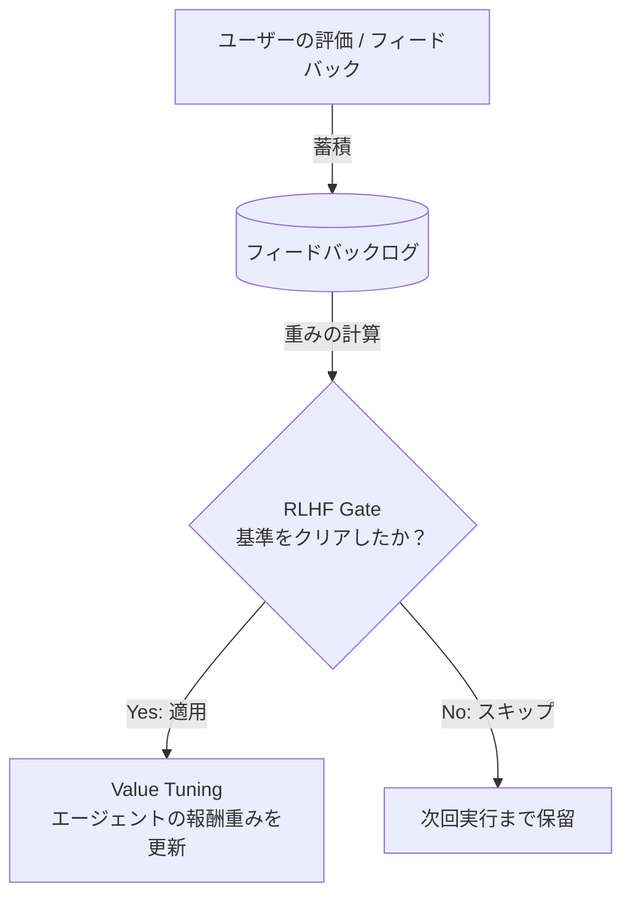

# システムコンセプト用語集 (Concept Dictionary)

本システムは、非常に高度な自律型エージェントおよびLLM制御技術（自己改善、RLHF、メモリ管理）を採用しています。初心者向けに、各コンセプトの概要、例え話（メタファー）、および関連するソースファイルを解説します。

---

## 🧠 1. Memory System (メモリシステム / 記憶装置)

人間のように、エージェントも「過去の経験」や「実行手順」を記憶し、次の意思決定に活かします。本システムには以下のメモリがあります。

### A. Meta Memory (メタメモリ)
* **概要**: エージェント自身が「自分自身の行動や学習状態について客観的に把握しているメタ的な知識」です。「今どのタスクが得意か」「どの評価基準が下がっているか」といった自己認識を記録します。
* **例え話**: **「自己分析ノート」**。テストの点数を見ながら、「最近数学が苦手だから勉強しなきゃ」「国語は得意だから大丈夫」と自分で気付く能力です。
* **関連コード**: [learning_dashboard.py](file:///home/abemc/project_root/src/rag/learning_dashboard.py) 内の Meta Memory レンダリング部分。

### B. Procedural Memory (プロシージャルメモリ / 手続き記憶)
* **概要**: タスクを実行するための「具体的な手順やノウハウ」を記憶します。
* **例え話**: **「自転車の乗り方」や「秘伝のレシピ」**。言葉で説明しづらい「体で覚えた手順」であり、エージェントが「この質問には、まず検索して、次に要約して、最後にチェックする」といったワークフローの手順を記憶・再利用します。
* **関連コード**: [learning_dashboard.py](file:///home/abemc/project_root/src/rag/learning_dashboard.py) 内の Procedural Memory 部分。

---

## ⚖️ 2. Alignment & Optimization (アライメントと最適化)

LLMやエージェントの価値基準（親切さ、正確さ、倫理など）を、人間の好みに合わせて調整するプロセスです。

### A. RLHF Gate (RLHFゲート)
* **概要**: 人間のフィードバック（RLHF）をシステムに反映する際、データのクオリティや件数が十分かを判定し、アライメント更新を行うか制御する「安全弁」です。
* **例え話**: **「本番リリースの検問所」**。生徒のアンケート結果が3人分しかないときはカリキュラムを変更せず、100人分集まって明確な傾向が出て初めて「よし、教科書を変えよう（ゲートを開く）」と決定する仕組みです。
* **関連コード**: [learning_dashboard.py](file:///home/abemc/project_root/src/rag/learning_dashboard.py) 内の `_build_gate_history_rows`（前回の実行結果との重み差分を計算する箇所）。

### B. Value Tuning (価値軸調整)
* **概要**: エージェントが意思決定する際の複数の価値基準（例：正確性、丁寧さ、安全性、簡潔さ）のバランス（比重）を微調整することです。
* **例え話**: **「イコライザー（音質調整つまみ）」**。音楽の「低音」「高音」の音量バランスを調整するように、エージェントに対して「今は安全性(Safety)を最優先し、回答のスピード(Speed)は少し落としてよい」とつまみをひねって調整するイメージです。
* **関連コード**: [learning_dashboard.py](file:///home/abemc/project_root/src/rag/learning_dashboard.py) 内の Plotly レーダーチャートおよび進捗バーによる可視化。

---

## 🛡️ 3. Safety & Verification (安全性と検証)

エージェントが有害な出力をしないよう監視し、システムの変更によって性能が落ちていないかを検証する機構です。

### A. Ethics Guard (倫理ガード)
* **概要**: ユーザーからの入力、またはLLMからの出力の中に、倫理的に有害な表現（暴言、個人情報の漏洩、ハッキングの指示など）が含まれていないかを、LLMによる回答生成の「直前」と「直後」にリアルタイムで検知・ブロックする防壁です。
* **例え話**: **「学校の風紀委員 / フィルター」**。不適切な発言を口にする前に「それは言ってはいけません」と口を塞ぐ役割です。
* **関連コード**: [ethics_guard.py](file:///home/abemc/project_root/src/safety/ethics_guard.py) および [app.py](file:///home/abemc/project_root/app.py) 内の `_check_user_instruction_ethics`。

### B. Dataset Sanity Checker (データセット健全性チェッカー)
* **概要**: 評価用のデータセットファイルに、フォーマットエラー、必須項目の不足、データの重複、極端に長い文章などの「おかしなデータ（汚いデータ）」が混ざっていないかを事前にチェックするツールです。
* **例え話**: **「野菜の出荷前検査」**。虫食いがあったり、サイズが極端に違ったりする不良品をあらかじめ弾く作業です。
* **関連コード**: [dataset_sanity_checker.py](file:///home/abemc/project_root/src/evaluation/dataset_sanity_checker.py) （今回修正した、辞書データの自動読み込みや validation 項目）。
